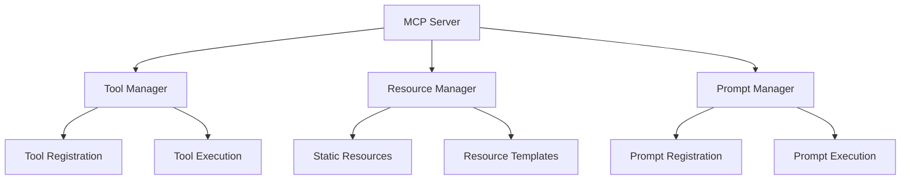
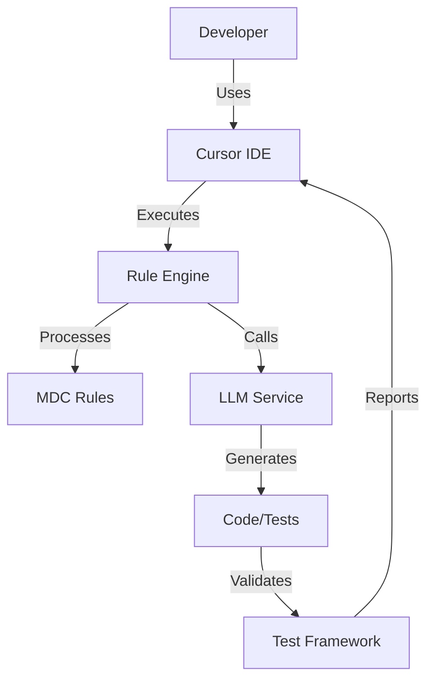
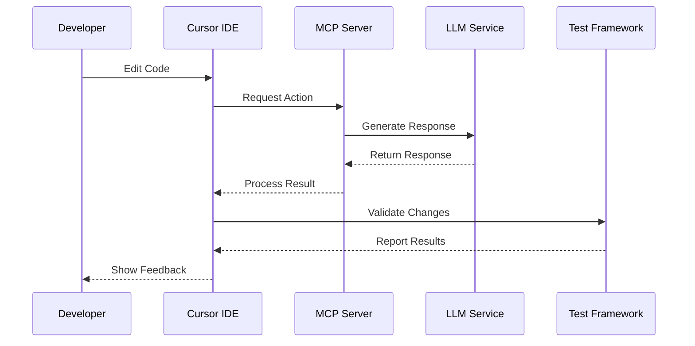

# Architecture Document: Codegen Lab - AI-Assisted Development Toolkit

<version>1.0.0</version>
<status>draft</status>

## Overview

This document outlines the technical architecture for the Codegen Lab project, an AI-assisted development toolkit that implements the Model Context Protocol (MCP) for structured communication between LLM clients and specialized servers.

## Core Components

### 1. Model Context Protocol (MCP) Server
- **Purpose**: Provides standardized communication between LLM clients and servers
- **Implementation**: FastMCP framework
- **Key Features**:
  - JSON-RPC 2.0 based communication
  - Resource management system
  - Tool integration framework
  - Prompt management system



### 2. Cursor Rules System
- **Purpose**: Manages and executes AI behavior rules
- **Components**:
  - Rule Engine
  - Rule Parser
  - Rule Validator
  - Rule Migration System

### 3. Test-Driven Development Framework
- **Purpose**: Ensures code quality through comprehensive testing
- **Components**:
  - Test Generator
  - Property-Based Testing System
  - Performance Testing Framework
  - Coverage Reporter

### 4. UV Workspace Management
- **Purpose**: Manages Python dependencies and virtual environments
- **Components**:
  - Package Manager
  - Virtual Environment Handler
  - Dependency Resolver
  - Lock File Manager

## Technical Architecture

### System Components Diagram



### Data Flow



## Implementation Details

### 1. MCP Server Implementation

```python
class FastMCP:
    def __init__(self,
        config: Optional[Config] = None,
        logger: Optional[Logger] = None):
        """Initialize FastMCP server with optional configuration."""

    async def add_tool(self,
        func: Callable,
        name: Optional[str] = None) -> None:
        """Register a new tool with the server."""

    async def start(self) -> None:
        """Start the FastMCP server."""
```

### 2. Rule Engine Implementation

```python
class RuleEngine:
    def __init__(self):
        self.rules: Dict[str, Rule] = {}
        self.validators: List[RuleValidator] = []

    async def process_rule(self, rule_id: str, context: Dict[str, Any]) -> Result:
        """Process a rule with given context."""
        pass

    async def validate_rule(self, rule: Rule) -> ValidationResult:
        """Validate a rule's structure and content."""
        pass
```

### 3. Test Framework Implementation

```python
class TestFramework:
    def __init__(self, config: TestConfig):
        self.config = config
        self.generators: List[TestGenerator] = []
        self.runners: List[TestRunner] = []

    async def generate_tests(self, source: str) -> List[TestCase]:
        """Generate test cases for given source code."""
        pass

    async def run_tests(self, tests: List[TestCase]) -> TestResults:
        """Execute test cases and return results."""
        pass
```

## Security Considerations

1. **API Key Management**
   - Environment variable storage
   - Regular key rotation
   - Secure key storage integration

2. **Code Generation Safety**
   - Syntax validation
   - Security vulnerability scanning
   - Sandboxed execution
   - Rate limiting

3. **Access Control**
   - Role-based access
   - Audit logging
   - Session management
   - Secure communication

## Performance Considerations

### MVP Phase Requirements
- LLM Response Time: < 5 seconds average
- Memory Usage: < 512MB peak
- CPU Usage: < 50% during normal operation

### Future Phase Targets
- LLM Response Time: < 2 seconds average
- Memory Usage: < 256MB peak
- CPU Usage: < 30% during normal operation

## Deployment Strategy

1. **Local Development**
   - UV for dependency management
   - Pre-commit hooks for code quality
   - Local MCP server instance

2. **Testing Environment**
   - Automated test suite execution
   - Performance testing infrastructure
   - Security scanning integration

3. **Production Environment**
   - Containerized deployment
   - Resource monitoring
   - Error tracking
   - Performance metrics collection

## Dependencies

| Component | Technology | Version |
|-----------|------------|----------|
| Python | Runtime | 3.12+ |
| UV | Package Manager | Latest |
| pytest | Testing | Latest |
| FastAPI | API Framework | Latest |
| Pydantic | Data Validation | Latest |
| Rich | Terminal UI | Latest |
| Ruff | Linting | Latest |
| BasedPyright | Type Checking | Latest |

## Future Considerations

1. **Scalability**
   - Distributed MCP server deployment
   - Load balancing for LLM requests
   - Caching layer for common operations

2. **Extensibility**
   - Plugin system for custom tools
   - Custom rule types
   - Additional LLM integrations

3. **Monitoring**
   - Telemetry collection
   - Performance monitoring
   - Error tracking
   - Usage analytics

## Open Questions

1. How will we handle versioning of MCP protocol changes?
2. What metrics should we collect for performance monitoring?
3. How can we optimize LLM response times?
4. What's the strategy for handling breaking changes in dependencies?

## Risks and Mitigations

1. **LLM Integration Risks**
   - Risk: LLM API downtime or failures
   - Mitigation: Implement robust error handling, fallback mechanisms, and retry logic

2. **Performance Risks**
   - Risk: High latency in code generation and analysis
   - Mitigation: Implement caching, optimize request batching, and set up performance monitoring

3. **Security Risks**
   - Risk: Exposure of sensitive code or data to LLMs
   - Mitigation: Implement strict data filtering, token validation, and access controls

4. **Dependency Risks**
   - Risk: Breaking changes in key dependencies
   - Mitigation: Pin dependency versions, implement comprehensive testing, maintain dependency update strategy

## Technical Decisions and Trade-offs

1. **FastMCP Framework Selection**
   - Decision: Use FastMCP for MCP server implementation
   - Rationale: Provides standardized communication, good performance, and easy integration
   - Trade-offs:
     - Pros: Well-documented, actively maintained, strong typing support
     - Cons: Newer framework, smaller community

2. **UV Package Manager**
   - Decision: Use UV over pip/poetry
   - Rationale: Better performance, lockfile support, workspace management
   - Trade-offs:
     - Pros: Faster, better dependency resolution
     - Cons: Newer tool, may have undiscovered issues

3. **Test Framework Choice**
   - Decision: pytest with custom extensions
   - Rationale: Industry standard, extensive plugin ecosystem
   - Trade-offs:
     - Pros: Well-documented, large community, flexible
     - Cons: Can be slower than alternatives for large test suites

## System Requirements

1. **Development Environment**
   - Python 3.12+
   - 4GB RAM minimum
   - 2 CPU cores minimum
   - 10GB free disk space

2. **Production Environment**
   - 8GB RAM recommended
   - 4 CPU cores recommended
   - 20GB free disk space
   - Network bandwidth: 10Mbps minimum

3. **Client Requirements**
   - VS Code with Cursor extension
   - 4GB RAM minimum
   - Modern web browser for web interface

## Backup and Recovery

1. **Data Persistence**
   - Cache storage strategy
   - Generated code backup approach
   - Configuration persistence

2. **Recovery Procedures**
   - Service recovery steps
   - Data recovery process
   - Rollback procedures

3. **Monitoring and Alerts**
   - System health monitoring
   - Performance metric collection
   - Alert thresholds and notification channels
