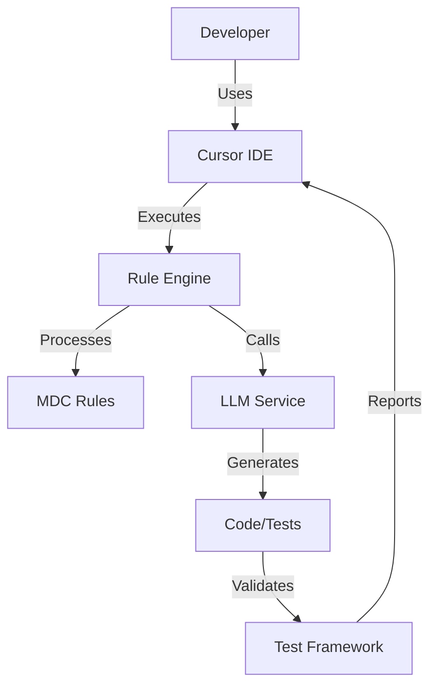
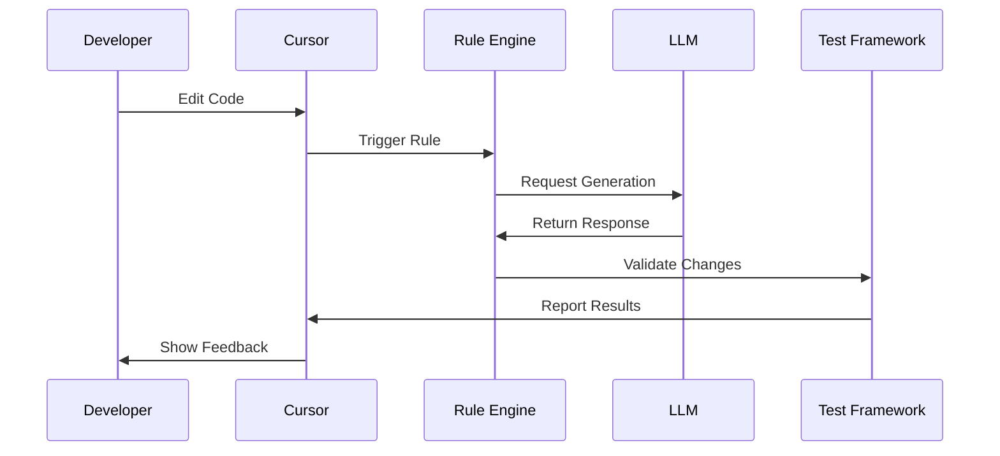
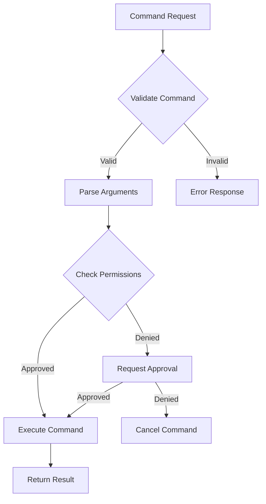

# Title: PRD for LLM Codegen Lab

<version>1.0.0</version>

## Status: Draft

## Intro

The LLM Codegen Lab project aims to build a comprehensive toolkit for AI-assisted code generation workflows. This project will provide developers with a powerful set of tools for integrating Large Language Models (LLMs) into their development process, focusing on test-driven development, code quality, and efficient workflow automation. The toolkit will streamline the interaction between developers, LLMs, and development tools while maintaining high standards for code quality and testing.

A key feature of the project is its implementation of the Anthropic Model Context Protocol (MCP), a standardized JSON-RPC 2.0 based communication protocol for LLM interactions. MCP enables structured, bidirectional communication between LLM clients and servers, providing robust support for resource management, tool invocation, prompt templates, and LLM sampling. This standardization ensures reliable and efficient communication while maintaining flexibility for future enhancements.

## Goals

- Create a robust framework for AI-assisted code generation that integrates seamlessly with existing development workflows
- Achieve 90% test coverage for core modules through comprehensive test-driven development
- Reduce development time by 40% through automated code generation and testing
- Ensure high code quality through automated review and testing processes
- Provide a seamless integration experience with Cursor IDE and other development tools

### Key Performance Indicators (KPIs)

#### MVP Phase
- Test coverage >= 70% for core modules
- Reasonable response times for LLM interactions (targeting < 5 seconds)
- Code quality score >= 7/10 based on established metrics
- Developer productivity improvement >= 20%
- Zero critical security vulnerabilities in generated code
- 90% compliance with Python type hints and documentation standards

#### Future Optimization Phase
- Test coverage >= 90% for all modules
- LLM interaction response time < 2 seconds
- Code quality score >= 8/10
- Developer productivity improvement >= 40%
- Zero security vulnerabilities of any severity
- 100% compliance with Python type hints and documentation standards

## Features and Requirements

### Functional Requirements

1. Cursor Agent Integration
   - Process and execute cursor rule files (*.mdc)
   - Support rule inheritance and composition
   - Provide real-time rule validation
   - Enable dynamic rule updates

2. Test-Driven Development Framework
   - Automated test case generation
   - Test coverage reporting
   - Integration with pytest ecosystem
   - Support for property-based testing

3. UV Workspace Management
   - Automated workspace initialization
   - Dependency version management
   - Virtual environment handling
   - Package installation and updates

4. Task Runner Integration
   - Task definition and execution
   - LLM interaction task support
   - Development workflow automation
   - Build and deployment task management

### Non-functional Requirements

1. Performance (MVP Phase)
   - Reasonable response times for LLM interactions
   - Efficient resource utilization
   - Performance monitoring infrastructure
   - Regular performance metric collection

   Future Optimization Targets:
   - LLM response time < 2 seconds
   - Task execution overhead < 500ms
   - Memory usage < 512MB
   - CPU usage < 50% during normal operation

2. Security
   - Secure API key management
   - Code generation safety checks
   - Dependency vulnerability scanning
   - Access control for sensitive operations

3. Reliability
   - 99.9% uptime for core services
   - Automatic error recovery
   - Graceful degradation
   - Comprehensive error logging

4. Maintainability
   - Modular architecture
   - Comprehensive documentation
   - Clear code organization
   - Automated testing

## Epic List

### Epic-6: Cursor Rules Migration (MVP)

Implement a comprehensive migration system to convert existing cursor rules to the new V2 format with improved organization and standardization.

Stories:
- Story 1: Rule Organization Structure
  Requirements:
  - Create standardized directory structure under .cursor/rules/
  - Set up core-rules, global-rules, testing-rules, tool-rules, and language-specific directories
  - Implement rule type detection and categorization
  - Add validation for directory structure compliance
  - Create migration scripts for existing rules

- Story 2: Rule Format Standardization
  Requirements:
  - Implement frontmatter validation and conversion
  - Create rule naming convention enforcement
  - Set up glob pattern standardization
  - Add rule content validation
  - Implement example section validation
  - Create documentation section requirements

- Story 3: Migration Tooling
  Requirements:
  - Create automated rule analysis tools
  - Implement rule conversion utilities
  - Add validation reporting
  - Create backup and rollback capabilities
  - Implement migration logging
  - Add progress tracking and reporting

- Story 4: Quality Assurance
  Requirements:
  - Implement rule testing framework
  - Create validation test suites
  - Add regression testing
  - Implement performance benchmarking
  - Create migration success metrics
  - Add automated quality checks

### Epic-1: Core Infrastructure (MVP)

Focus on establishing the fundamental infrastructure required for the LLM Codegen Lab toolkit.

Stories:
- Story 1: Project Foundation Setup
  Requirements:
  - Initialize project structure with proper packaging
  - Set up UV workspace and virtual environment
  - Configure development tools (pre-commit, ruff, pytest)
  - Create initial documentation structure
  - Implement logging infrastructure

- Story 2: Core Service Architecture
  Requirements:
  - Implement service container and dependency injection
  - Create core service interfaces and base classes
  - Set up configuration management system
  - Implement plugin architecture for extensibility
  - Add health check and monitoring endpoints

- Story 3: LLM Integration Framework
  Requirements:
  - Implement LLM service abstraction layer
  - Create API key and credentials management
  - Set up request/response handling
  - Implement rate limiting and caching
  - Add error handling and retry logic

- Story 4: Data Storage and State Management
  Requirements:
  - Implement workspace state management
  - Create file system abstraction layer
  - Set up caching mechanisms
  - Implement data persistence layer
  - Add data migration capabilities

### Epic-2: Cursor Integration (MVP)

Implement comprehensive integration with Cursor IDE and establish the rule processing system.

Stories:
- Story 1: Basic Cursor IDE Integration
  Requirements:
  - Implement basic file watching
  - Set up command routing
  - Create event handling system
  - Basic error reporting

- Story 2: MDC Rule File Processing
  Requirements:
  - Parse MDC file format
  - Implement rule loading
  - Add basic validation
  - Create rule cache system

- Story 3: Rule Validation System
  Requirements:
  - Implement syntax validation
  - Add semantic validation
  - Create error reporting
  - Set up validation caching

### Epic-3: Testing Framework (MVP)

Develop the test-driven development framework and testing infrastructure.

Stories:
- Story 1: Basic Test Framework Setup
  Requirements:
  - Set up pytest configuration
  - Implement basic fixtures
  - Create test utilities
  - Add basic assertions

- Story 2: Test Case Generation
  Requirements:
  - Implement test template system
  - Add parameter generation
  - Create mock data utilities
  - Set up test organization

- Story 3: Basic Coverage Reporting
  Requirements:
  - Set up coverage collection
  - Implement report generation
  - Add coverage visualization
  - Create coverage tracking

### Epic-4: Advanced Features (Future)

Implement advanced features such as automated code review, enhanced LLM integration, and workflow automation.

### Epic-5: Model Context Protocol (MCP) Integration

Implement comprehensive support for the Anthropic Model Context Protocol (MCP) to enable standardized communication between LLM clients and servers.

Stories:
- Story 1: MCP Core Protocol Implementation
  Requirements:
  - Implement JSON-RPC 2.0 based communication layer
  - Set up bidirectional message handling
  - Create protocol initialization flow
  - Implement capability negotiation
  - Add error handling and logging

- Story 2: Resource Management System
  Requirements:
  - Implement resource discovery and listing
  - Create resource template system
  - Set up resource content retrieval
  - Add resource subscription handling
  - Implement resource update notifications

- Story 3: Tool Integration Framework
  Requirements:
  - Create tool definition system
  - Implement tool invocation handling
  - Set up tool result processing
  - Add tool error handling
  - Create tool discovery mechanism

- Story 4: Prompt Management
  Requirements:
  - Implement prompt template system
  - Create prompt argument handling
  - Set up prompt completion
  - Add prompt validation
  - Implement prompt discovery

- Story 5: LLM Sampling Integration
  Requirements:
  - Implement sampling request handling
  - Create message creation system
  - Set up model preferences
  - Add progress tracking
  - Implement sampling result processing

## Technology Stack

| Technology | Description |
|------------|-------------|
| Python 3.12+ | Primary programming language with strict type checking |
| pytest | Testing framework with asyncio support |
| UV | Package management and virtual environment |
| Cursor IDE | Development environment with BasedPyright |
| FastAPI | API framework for tools |
| Pydantic | Data validation and settings management |
| OpenAI API | LLM integration |
| GitHub Actions | CI/CD platform |
| Ruff | Code formatting and linting |
| BasedPyright | Static type checking |
| Rich | Terminal formatting and output |
| Langchain | LLM framework and tools |
| MCP | Anthropic Model Context Protocol for standardized LLM communication |
| JSON-RPC 2.0 | Protocol foundation for MCP implementation |

## Development Environment

### IDE Configuration
- VSCode/Cursor with BasedPyright extension
- Type checking mode: recommended
- Line length: 120 characters
- Inlay hints enabled for:
  - Variable types
  - Function return types
  - Call argument names
  - Generic types

### Required Environment Variables
- CODEGEN_LAB_CONFIG_ENABLE_REDIS: Redis integration flag
- CODEGEN_LAB_CONFIG_ENABLE_AI: AI features toggle
- LANGCHAIN_DEBUG_LOGS: Debug logging for Langchain
- PYTHONVERBOSE: Python verbosity level
- PYTHONASYNCIODEBUG: Async debugging toggle
- Various API keys (managed securely)

### Development Tools
- Pre-commit hooks for code quality
- Ruff for code formatting and linting
- Pytest for test automation
- UV for dependency management
- Towncrier for changelog management
- Make for build automation

### Code Quality Standards
- 100% type hint coverage
- Docstring coverage for all public APIs
- Maximum complexity score: 10
- Minimum test coverage: 70% (MVP), 90% (Future)
- Zero critical security vulnerabilities
- Compliant with PEP 8 and project-specific style guide

## Reference

### System Architecture



### Rule Processing Flow



### Command Routing Format and Specifications

#### MCP Integration

The command routing system follows the Model Context Protocol (MCP) specification for seamless integration between LLMs and development tools.

##### Server Configuration
```python
{
    "mcpServers": {
        "codegen-lab": {
            "command": "python",
            "args": ["-m", "fastmcp", "serve"],
            "resources": {
                "workspace": "./workspace",
                "config": "./config"
            }
        }
    }
}
```

##### Command Structure
1. **Base Command Format**
```python
{
    "command": str,              # The command identifier
    "args": dict,               # Command arguments
    "context": dict,            # Execution context
    "metadata": dict,           # Optional metadata
    "require_approval": bool    # Whether user approval is required
}
```

2. **Standard Commands**
- `init`: Initialize workspace
- `test`: Run test suites
- `generate`: Generate code
- `validate`: Validate rules
- `analyze`: Code analysis
- `refactor`: Code refactoring

3. **Command Routing Flow**


#### FastMCP Integration

The system uses FastMCP for efficient command routing and execution:

1. **Server Setup**
```python
from fastmcp import FastMCPServer
from fastmcp.tools import CodegenTools

server = FastMCPServer(
    name="codegen-lab",
    tools=[CodegenTools],
    config={
        "workspace_dir": "./workspace",
        "max_concurrent_tasks": 10,
        "timeout_seconds": 300
    }
)
```

2. **Command Handlers**
```python
@server.command("generate")
async def handle_generate(
    context: dict,
    args: dict,
    metadata: Optional[dict] = None
) -> MCPResponse:
    """Handle code generation requests."""
    return await CodegenTools.generate(**args)
```

3. **Response Format**
```python
{
    "status": str,              # "success" or "error"
    "data": Any,               # Response data
    "metadata": dict,          # Response metadata
    "errors": Optional[list]   # Error details if status is "error"
}
```

#### Security and Rate Limiting

1. **Authentication**
- JWT-based authentication for API access
- Role-based access control for commands
- Secure credential storage using environment variables

2. **Rate Limiting**
```python
{
    "limits": {
        "default": "100/minute",
        "generate": "20/minute",
        "analyze": "50/minute"
    },
    "timeout": 30,
    "max_retries": 3
}
```

3. **Error Handling**
- Standardized error codes and messages
- Automatic retry for transient failures
- Detailed error logging and monitoring

#### Performance Requirements

1. **Latency Targets**
- Command validation: < 50ms
- Simple commands: < 100ms
- Complex commands: < 1000ms
- Async operations: Background processing with status updates

2. **Resource Limits**
- Maximum concurrent commands: 10
- Memory usage per command: < 256MB
- Command timeout: 5 minutes
- Rate limiting: Configurable per command type

## Data Models, API Specs, Schemas

### Rule Schema

```python
class Rule(BaseModel):
    name: str
    description: str
    version: str
    filters: List[Filter]
    actions: List[Action]
    metadata: Dict[str, Any]

class Filter(BaseModel):
    type: str
    pattern: str
    options: Optional[Dict[str, Any]]

class Action(BaseModel):
    type: str
    message: str
    conditions: Optional[List[Condition]]
```

### Configuration Schema

```python
class CodegenLabConfig(BaseModel):
    enable_redis: bool = Field(default=False, env="CODEGEN_LAB_CONFIG_ENABLE_REDIS")
    enable_ai: bool = Field(default=False, env="CODEGEN_LAB_CONFIG_ENABLE_AI")
    debug_langchain: bool = Field(default=False, env="CODEGEN_LAB_CONFIG_DEBUG_LANGCHAIN")
    sentry_dsn: Optional[str] = Field(default=None, env="CODEGEN_LAB_CONFIG_SENTRY_DSN")
    enable_sentry: bool = Field(default=False, env="CODEGEN_LAB_CONFIG_ENABLE_SENTRY")

class LLMConfig(BaseModel):
    api_key: SecretStr
    model: str
    temperature: float = 0.7
    max_tokens: int = 2000
    timeout: int = 30

class TestConfig(BaseModel):
    min_coverage: float = 70.0
    fail_under: float = 70.0
    show_missing: bool = True
    skip_covered: bool = True
```

### Command Line Interface

The project provides two main entry points:
- `codegen-lab`: Primary CLI tool for code generation tasks
- `clctl`: Control interface for managing the Codegen Lab environment

Common commands:
```bash
# Initialize workspace
codegen-lab init

# Run tests with coverage
codegen-lab test --coverage

# Generate new rule
clctl rule create --name <rule_name>

# Validate rules
clctl validate-rules
```

## Performance Requirements

### MVP Phase
- LLM Response Time:
  - Average: < 5 seconds
  - P95: < 8 seconds
  - P99: < 10 seconds
- Memory Usage:
  - Base: < 256MB
  - Peak: < 512MB
- CPU Usage:
  - Idle: < 5%
  - Active: < 50%
  - Peak: < 80%

### Future Phase
- LLM Response Time:
  - Average: < 2 seconds
  - P95: < 4 seconds
  - P99: < 6 seconds
- Memory Usage:
  - Base: < 128MB
  - Peak: < 256MB
- CPU Usage:
  - Idle: < 2%
  - Active: < 30%
  - Peak: < 60%

## Security Requirements

1. API Key Management
   - All API keys stored in environment variables
   - No hardcoded secrets in codebase
   - Regular key rotation support
   - Secure key storage integration

2. Code Generation Safety
   - Syntax validation before execution
   - Security vulnerability scanning
   - Sandboxed execution environment
   - Rate limiting for API calls

3. Access Control
   - Role-based access control
   - Audit logging
   - Session management
   - Secure communication channels

4. Dependency Management
   - Regular dependency updates
   - Vulnerability scanning
   - Lock file validation
   - Supply chain security checks

## Project Structure

```text
codegen-lab/
├── .ai/                    # AI documentation and memory
├── .cursor/                # Cursor IDE configuration
│   └── templates/          # Document templates
├── src/                    # Source code
│   └── codegen_lab/       # Main package
│       ├── rules/         # Rule processing
│       ├── testing/       # Test framework
│       ├── workspace/     # UV workspace management
│       └── tasks/         # Task runner
├── tests/                 # Test suite
│   ├── unit/             # Unit tests
│   └── integration/      # Integration tests
├── docs/                 # Documentation
└── hack/                 # Development scripts
    └── drafts/          # Draft rules and configs
```

## Getting Started Guide for Junior Developers

### Initial Setup
1. Clone the repository
2. Install UV package manager
3. Create virtual environment
4. Install dependencies

### Development Workflow
1. Choose a story from current sprint
2. Create feature branch
3. Write tests first (TDD approach)
4. Implement functionality
5. Run tests and linting
6. Submit PR for review

### Key Concepts
- Rule Engine: Processes MDC files for AI interactions
- Test Framework: Automated testing infrastructure
- Workspace Management: Handles project dependencies
- Task Runner: Automates development tasks

## Change Log

| Change | Story ID | Description |
|--------|----------|-------------|
| Initial draft | N/A | Initial PRD creation |
| MVP Refinement | N/A | Updated KPIs and requirements for MVP phase, added detailed stories for Epic-2 and Epic-3, added schemas and getting started guide |

### Testing Framework Technical Specifications

#### Advanced Test Case Generation

1. **AI-Assisted Test Generation**
```python
class AITestGenerator(BaseModel):
    """AI-powered test case generator."""
    model_config: LLMConfig
    code_context: CodeContext
    test_requirements: TestRequirements
    generation_strategy: Literal["coverage", "mutation", "behavior"] = "coverage"

    class TestRequirements(BaseModel):
        coverage_targets: Dict[str, float]
        complexity_threshold: int = 10
        edge_case_percentage: float = 20.0
        mutation_score_target: float = 85.0

    class CodeContext(BaseModel):
        source_code: str
        dependencies: List[str]
        type_hints: Dict[str, str]
        docstring: Optional[str]
        existing_tests: List[str]
```

2. **Test Data Generation**
```python
class TestDataGenerator(BaseModel):
    """Intelligent test data generation system."""

    class DataStrategy(BaseModel):
        strategy_type: Literal["random", "boundary", "equivalence", "mutation"]
        constraints: List[Constraint]
        sample_size: int
        seed: Optional[int]

    class Constraint(BaseModel):
        field_name: str
        value_type: str
        range: Optional[Tuple[Any, Any]]
        allowed_values: Optional[List[Any]]
        pattern: Optional[str]

    async def generate_test_data(
        self,
        strategy: DataStrategy,
        context: TestContext
    ) -> TestDataSet:
        """Generate test data based on strategy and context."""
        pass
```

3. **Test Case Prioritization**
```python
class TestPrioritizer(BaseModel):
    """Test case prioritization engine."""

    class PrioritizationStrategy(BaseModel):
        criteria: List[str]  # e.g., ["coverage", "complexity", "history"]
        weights: Dict[str, float]
        time_budget: Optional[int]

    class TestMetadata(BaseModel):
        execution_time: float
        coverage_impact: float
        failure_history: List[FailureRecord]
        dependencies: List[str]

    async def prioritize_test_suite(
        self,
        tests: List[TestCase],
        strategy: PrioritizationStrategy
    ) -> List[PrioritizedTest]:
        """Prioritize test cases based on strategy."""
        pass
```

#### Property-Based Testing Framework

1. **Core Components**
```python
class PropertyTest(BaseModel):
    name: str
    property_definition: str
    strategies: List[TestStrategy]
    assumptions: List[str]
    minimal_cases: int = 100
    max_examples: int = 1000
    deadline: Optional[int] = None

class TestStrategy(BaseModel):
    name: str
    generator: Callable
    filters: List[Callable]
    custom_params: Dict[str, Any]
```

2. **Property Test Generators**
```python
class PropertyTestGenerator(BaseModel):
    """Generator for property-based tests."""

    class PropertyTemplate(BaseModel):
        name: str
        description: str
        property_type: Literal["invariant", "metamorphic", "stateful"]
        input_space: InputSpaceDefinition
        oracle: TestOracle

    class InputSpaceDefinition(BaseModel):
        dimensions: List[DimensionSpec]
        constraints: List[str]
        sampling_strategy: SamplingStrategy

    async def generate_property_tests(
        self,
        source_code: str,
        template: PropertyTemplate
    ) -> List[PropertyTest]:
        """Generate property-based tests from template."""
        pass
```

3. **Test Oracle System**
```python
class TestOracle(BaseModel):
    """System for validating test outcomes."""

    class OracleType(Enum):
        INVARIANT = "invariant"
        METAMORPHIC = "metamorphic"
        REGRESSION = "regression"
        PERFORMANCE = "performance"

    class OracleConfig(BaseModel):
        oracle_type: OracleType
        validation_rules: List[str]
        tolerance: float = 0.001
        timeout: int = 30

    async def validate_property(
        self,
        test_case: PropertyTest,
        result: Any,
        config: OracleConfig
    ) -> ValidationResult:
        """Validate test results against oracle."""
        pass
```

#### Performance Testing Framework

1. **Core Components**
```python
class PerformanceTest(BaseModel):
    name: str
    target_function: Callable
    load_profile: LoadProfile
    success_criteria: SuccessCriteria
    monitoring_config: MonitoringConfig

class LoadProfile(BaseModel):
    type: Literal["constant", "step", "ramp", "custom"]
    duration: int
    users: int
    step_time: Optional[int] = None
    step_users: Optional[int] = None
    custom_profile: Optional[Callable] = None

class SuccessCriteria(BaseModel):
    max_response_time: float
    mean_response_time: float
    error_rate: float
    throughput: float

class MonitoringConfig(BaseModel):
    metrics: List[str]
    interval: int
    exporters: List[str]
    alerts: List[Alert]
```

2. **Performance Metrics Collection**
```python
class MetricsCollector(BaseModel):
    """System for collecting and analyzing performance metrics."""

    class MetricDefinition(BaseModel):
        name: str
        type: Literal["counter", "gauge", "histogram", "summary"]
        unit: str
        description: str
        labels: List[str]

    class CollectionConfig(BaseModel):
        metrics: List[MetricDefinition]
        interval: int
        aggregation: AggregationConfig
        storage: StorageConfig

    async def collect_metrics(
        self,
        test_run: TestRun,
        config: CollectionConfig
    ) -> MetricsData:
        """Collect performance metrics during test execution."""
        pass
```

3. **Performance Analysis Engine**
```python
class PerformanceAnalyzer(BaseModel):
    """Engine for analyzing performance test results."""

    class AnalysisConfig(BaseModel):
        baseline_id: str
        comparison_method: Literal["threshold", "relative", "statistical"]
        significance_level: float = 0.05
        metrics_of_interest: List[str]

    class RegressionDetector(BaseModel):
        detection_method: Literal["zscore", "mad", "iqr"]
        window_size: int
        threshold: float
        min_samples: int = 30

    async def analyze_performance(
        self,
        current_run: TestRun,
        config: AnalysisConfig
    ) -> PerformanceReport:
        """Analyze performance test results and detect regressions."""
        pass
```

4. **Resource Monitoring**
```python
class ResourceMonitor(BaseModel):
    """System for monitoring system resources during tests."""

    class ResourceMetrics(BaseModel):
        cpu_usage: List[float]
        memory_usage: List[float]
        io_operations: List[IOMetric]
        network_usage: List[NetworkMetric]

    class MonitoringThresholds(BaseModel):
        cpu_threshold: float = 75.0
        memory_threshold: float = 85.0
        io_threshold: float = 1000
        network_threshold: float = 100

    async def monitor_resources(
        self,
        test_run: TestRun,
        thresholds: MonitoringThresholds
    ) -> ResourceMetrics:
        """Monitor system resources during test execution."""
        pass
```
