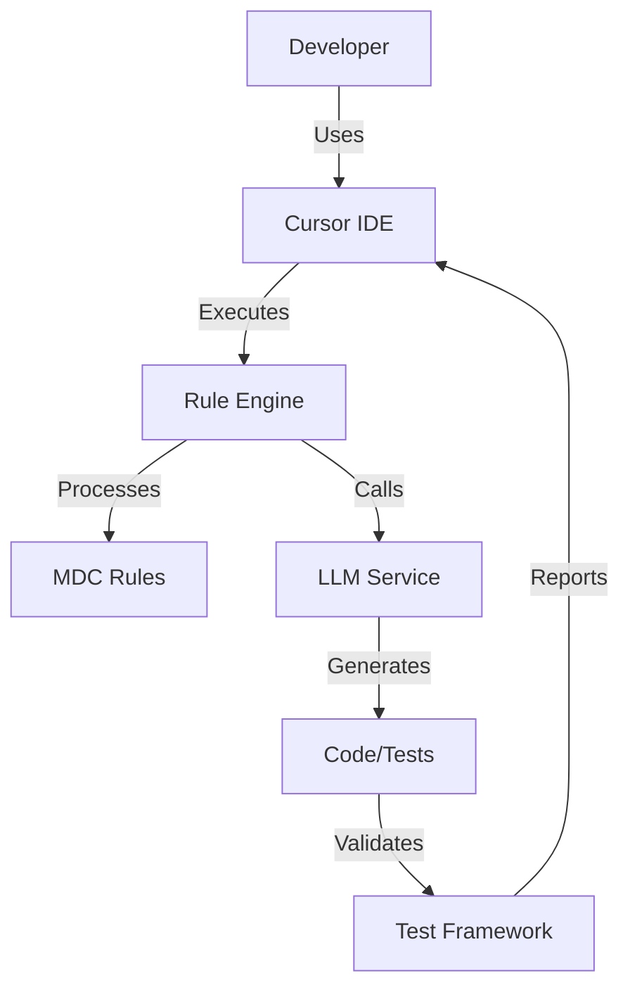
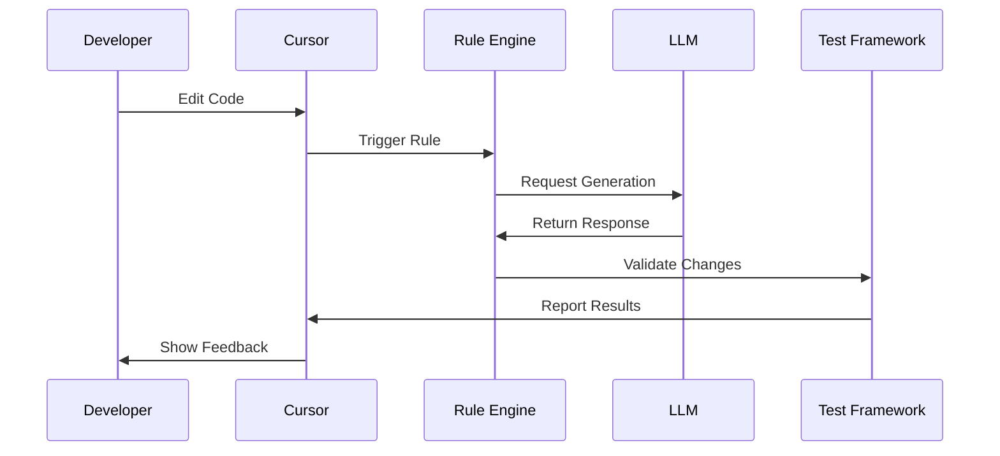

# Title: PRD for LLM Codegen Lab

<version>1.0.0</version>

## Status: Draft

## Intro

The LLM Codegen Lab project aims to build a comprehensive toolkit for AI-assisted code generation workflows. This project will provide developers with a powerful set of tools for integrating Large Language Models (LLMs) into their development process, focusing on test-driven development, code quality, and efficient workflow automation. The toolkit will streamline the interaction between developers, LLMs, and development tools while maintaining high standards for code quality and testing.

## Goals

- Create a robust framework for AI-assisted code generation that integrates seamlessly with existing development workflows
- Achieve 90% test coverage for core modules through comprehensive test-driven development
- Reduce development time by 40% through automated code generation and testing
- Ensure high code quality through automated review and testing processes
- Provide a seamless integration experience with Cursor IDE and other development tools

### Key Performance Indicators (KPIs)
- Test coverage >= 90% for core modules
- Average response time for LLM interactions < 2 seconds
- Code quality score >= 8/10 based on established metrics
- Developer productivity improvement >= 40%
- Zero security vulnerabilities in generated code
- 100% compliance with Python type hints and documentation standards

## Features and Requirements

### Functional Requirements

1. Cursor Agent Integration
   - Process and execute cursor rule files (*.mdc)
   - Support rule inheritance and composition
   - Provide real-time rule validation
   - Enable dynamic rule updates

2. Test-Driven Development Framework
   - Automated test case generation
   - Test coverage reporting
   - Integration with pytest ecosystem
   - Support for property-based testing

3. UV Workspace Management
   - Automated workspace initialization
   - Dependency version management
   - Virtual environment handling
   - Package installation and updates

4. Task Runner Integration
   - Task definition and execution
   - LLM interaction task support
   - Development workflow automation
   - Build and deployment task management

### Non-functional Requirements

1. Performance
   - LLM response time < 2 seconds
   - Task execution overhead < 500ms
   - Memory usage < 512MB
   - CPU usage < 50% during normal operation

2. Security
   - Secure API key management
   - Code generation safety checks
   - Dependency vulnerability scanning
   - Access control for sensitive operations

3. Reliability
   - 99.9% uptime for core services
   - Automatic error recovery
   - Graceful degradation
   - Comprehensive error logging

4. Maintainability
   - Modular architecture
   - Comprehensive documentation
   - Clear code organization
   - Automated testing

## Epic List

### Epic-1: Core Infrastructure (MVP)

Focus on establishing the fundamental infrastructure required for the LLM Codegen Lab toolkit.

### Epic-2: Cursor Integration (MVP)

Implement comprehensive integration with Cursor IDE and establish the rule processing system.

### Epic-3: Testing Framework (MVP)

Develop the test-driven development framework and testing infrastructure.

### Epic-4: Advanced Features (Future)

Implement advanced features such as automated code review, enhanced LLM integration, and workflow automation.

## Epic 1: Story List

- Story 1: Project Setup
  Status: ''
  Requirements:
  - Initialize project structure
  - Set up dependency management
  - Configure development environment
  - Implement basic CLI

- Story 2: Core Rule Engine
  Status: ''
  Requirements:
  - Implement rule parsing
  - Create rule validation system
  - Develop rule execution engine
  - Add rule inheritance support

- Story 3: Test Framework Setup
  Status: ''
  Requirements:
  - Set up pytest infrastructure
  - Implement test generators
  - Create coverage reporting
  - Add test utilities

## Technology Stack

| Technology | Description |
|------------|-------------|
| Python 3.11+ | Primary programming language |
| pytest | Testing framework |
| UV | Package management |
| Cursor IDE | Development environment |
| FastAPI | API framework for tools |
| Pydantic | Data validation |
| OpenAI API | LLM integration |
| GitHub Actions | CI/CD platform |

## Reference

### System Architecture



### Rule Processing Flow



## Data Models, API Specs, Schemas

### Rule Schema

```python
class Rule(BaseModel):
    name: str
    description: str
    version: str
    filters: List[Filter]
    actions: List[Action]
    metadata: Dict[str, Any]

class Filter(BaseModel):
    type: str
    pattern: str
    options: Optional[Dict[str, Any]]

class Action(BaseModel):
    type: str
    message: str
    conditions: Optional[List[Condition]]
```

### Test Configuration Schema

```python
class TestConfig(BaseModel):
    name: str
    framework: str = "pytest"
    coverage_target: float = 90.0
    test_paths: List[str]
    markers: Optional[List[str]]
    plugins: Optional[List[str]]
```

## Project Structure

```text
codegen-lab/
├── .ai/                    # AI documentation and memory
├── .cursor/                # Cursor IDE configuration
│   └── templates/          # Document templates
├── src/                    # Source code
│   └── codegen_lab/       # Main package
│       ├── rules/         # Rule processing
│       ├── testing/       # Test framework
│       ├── workspace/     # UV workspace management
│       └── tasks/         # Task runner
├── tests/                 # Test suite
│   ├── unit/             # Unit tests
│   └── integration/      # Integration tests
├── docs/                 # Documentation
└── hack/                 # Development scripts
    └── drafts/          # Draft rules and configs
```

## Change Log

| Change | Story ID | Description |
|--------|----------|-------------|
| Initial draft | N/A | Initial PRD creation |
