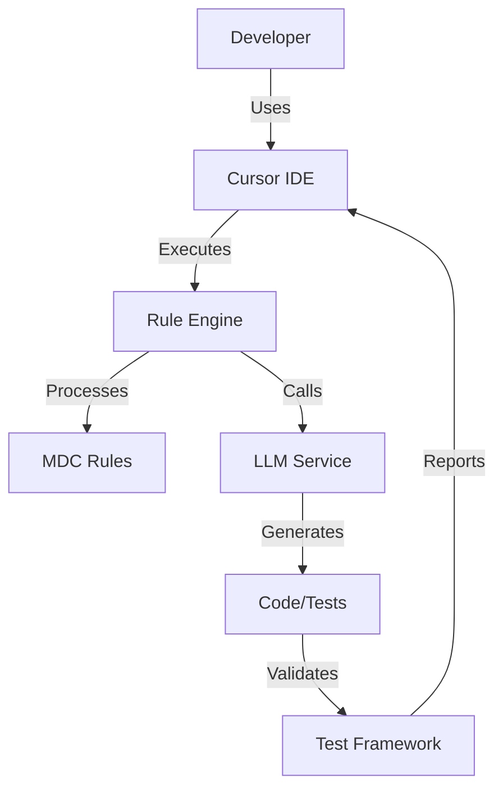
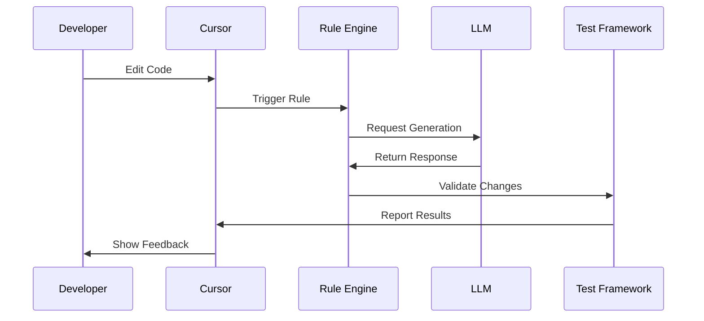

# Title: PRD for LLM Codegen Lab

<version>1.0.0</version>

## Status: Draft

## Intro

The LLM Codegen Lab project aims to build a comprehensive toolkit for AI-assisted code generation workflows. This project will provide developers with a powerful set of tools for integrating Large Language Models (LLMs) into their development process, focusing on test-driven development, code quality, and efficient workflow automation. The toolkit will streamline the interaction between developers, LLMs, and development tools while maintaining high standards for code quality and testing.

## Goals

- Create a robust framework for AI-assisted code generation that integrates seamlessly with existing development workflows
- Achieve 90% test coverage for core modules through comprehensive test-driven development
- Reduce development time by 40% through automated code generation and testing
- Ensure high code quality through automated review and testing processes
- Provide a seamless integration experience with Cursor IDE and other development tools

### Key Performance Indicators (KPIs)

#### MVP Phase
- Test coverage >= 70% for core modules
- Reasonable response times for LLM interactions (targeting < 5 seconds)
- Code quality score >= 7/10 based on established metrics
- Developer productivity improvement >= 20%
- Zero critical security vulnerabilities in generated code
- 90% compliance with Python type hints and documentation standards

#### Future Optimization Phase
- Test coverage >= 90% for all modules
- LLM interaction response time < 2 seconds
- Code quality score >= 8/10
- Developer productivity improvement >= 40%
- Zero security vulnerabilities of any severity
- 100% compliance with Python type hints and documentation standards

## Features and Requirements

### Functional Requirements

1. Cursor Agent Integration
   - Process and execute cursor rule files (*.mdc)
   - Support rule inheritance and composition
   - Provide real-time rule validation
   - Enable dynamic rule updates

2. Test-Driven Development Framework
   - Automated test case generation
   - Test coverage reporting
   - Integration with pytest ecosystem
   - Support for property-based testing

3. UV Workspace Management
   - Automated workspace initialization
   - Dependency version management
   - Virtual environment handling
   - Package installation and updates

4. Task Runner Integration
   - Task definition and execution
   - LLM interaction task support
   - Development workflow automation
   - Build and deployment task management

### Non-functional Requirements

1. Performance (MVP Phase)
   - Reasonable response times for LLM interactions
   - Efficient resource utilization
   - Performance monitoring infrastructure
   - Regular performance metric collection

   Future Optimization Targets:
   - LLM response time < 2 seconds
   - Task execution overhead < 500ms
   - Memory usage < 512MB
   - CPU usage < 50% during normal operation

2. Security
   - Secure API key management
   - Code generation safety checks
   - Dependency vulnerability scanning
   - Access control for sensitive operations

3. Reliability
   - 99.9% uptime for core services
   - Automatic error recovery
   - Graceful degradation
   - Comprehensive error logging

4. Maintainability
   - Modular architecture
   - Comprehensive documentation
   - Clear code organization
   - Automated testing

## Epic List

### Epic-1: Core Infrastructure (MVP)

Focus on establishing the fundamental infrastructure required for the LLM Codegen Lab toolkit.

Stories:
- Story 1: Project Foundation Setup
  Requirements:
  - Initialize project structure with proper packaging
  - Set up UV workspace and virtual environment
  - Configure development tools (pre-commit, ruff, pytest)
  - Create initial documentation structure
  - Implement logging infrastructure

- Story 2: Core Service Architecture
  Requirements:
  - Implement service container and dependency injection
  - Create core service interfaces and base classes
  - Set up configuration management system
  - Implement plugin architecture for extensibility
  - Add health check and monitoring endpoints

- Story 3: LLM Integration Framework
  Requirements:
  - Implement LLM service abstraction layer
  - Create API key and credentials management
  - Set up request/response handling
  - Implement rate limiting and caching
  - Add error handling and retry logic

- Story 4: Data Storage and State Management
  Requirements:
  - Implement workspace state management
  - Create file system abstraction layer
  - Set up caching mechanisms
  - Implement data persistence layer
  - Add data migration capabilities

### Epic-2: Cursor Integration (MVP)

Implement comprehensive integration with Cursor IDE and establish the rule processing system.

Stories:
- Story 1: Basic Cursor IDE Integration
  Requirements:
  - Implement basic file watching
  - Set up command routing
  - Create event handling system
  - Basic error reporting

- Story 2: MDC Rule File Processing
  Requirements:
  - Parse MDC file format
  - Implement rule loading
  - Add basic validation
  - Create rule cache system

- Story 3: Rule Validation System
  Requirements:
  - Implement syntax validation
  - Add semantic validation
  - Create error reporting
  - Set up validation caching

### Epic-3: Testing Framework (MVP)

Develop the test-driven development framework and testing infrastructure.

Stories:
- Story 1: Basic Test Framework Setup
  Requirements:
  - Set up pytest configuration
  - Implement basic fixtures
  - Create test utilities
  - Add basic assertions

- Story 2: Test Case Generation
  Requirements:
  - Implement test template system
  - Add parameter generation
  - Create mock data utilities
  - Set up test organization

- Story 3: Basic Coverage Reporting
  Requirements:
  - Set up coverage collection
  - Implement report generation
  - Add coverage visualization
  - Create coverage tracking

### Epic-4: Advanced Features (Future)

Implement advanced features such as automated code review, enhanced LLM integration, and workflow automation.

## Technology Stack

| Technology | Description |
|------------|-------------|
| Python 3.12+ | Primary programming language with strict type checking |
| pytest | Testing framework with asyncio support |
| UV | Package management and virtual environment |
| Cursor IDE | Development environment with BasedPyright |
| FastAPI | API framework for tools |
| Pydantic | Data validation and settings management |
| OpenAI API | LLM integration |
| GitHub Actions | CI/CD platform |
| Ruff | Code formatting and linting |
| BasedPyright | Static type checking |
| Rich | Terminal formatting and output |
| Langchain | LLM framework and tools |

## Development Environment

### IDE Configuration
- VSCode/Cursor with BasedPyright extension
- Type checking mode: recommended
- Line length: 120 characters
- Inlay hints enabled for:
  - Variable types
  - Function return types
  - Call argument names
  - Generic types

### Required Environment Variables
- CODEGEN_LAB_CONFIG_ENABLE_REDIS: Redis integration flag
- CODEGEN_LAB_CONFIG_ENABLE_AI: AI features toggle
- LANGCHAIN_DEBUG_LOGS: Debug logging for Langchain
- PYTHONVERBOSE: Python verbosity level
- PYTHONASYNCIODEBUG: Async debugging toggle
- Various API keys (managed securely)

### Development Tools
- Pre-commit hooks for code quality
- Ruff for code formatting and linting
- Pytest for test automation
- UV for dependency management
- Towncrier for changelog management
- Make for build automation

### Code Quality Standards
- 100% type hint coverage
- Docstring coverage for all public APIs
- Maximum complexity score: 10
- Minimum test coverage: 70% (MVP), 90% (Future)
- Zero critical security vulnerabilities
- Compliant with PEP 8 and project-specific style guide

## Reference

### System Architecture



### Rule Processing Flow



## Data Models, API Specs, Schemas

### Rule Schema

```python
class Rule(BaseModel):
    name: str
    description: str
    version: str
    filters: List[Filter]
    actions: List[Action]
    metadata: Dict[str, Any]

class Filter(BaseModel):
    type: str
    pattern: str
    options: Optional[Dict[str, Any]]

class Action(BaseModel):
    type: str
    message: str
    conditions: Optional[List[Condition]]
```

### Configuration Schema

```python
class CodegenLabConfig(BaseModel):
    enable_redis: bool = Field(default=False, env="CODEGEN_LAB_CONFIG_ENABLE_REDIS")
    enable_ai: bool = Field(default=False, env="CODEGEN_LAB_CONFIG_ENABLE_AI")
    debug_langchain: bool = Field(default=False, env="CODEGEN_LAB_CONFIG_DEBUG_LANGCHAIN")
    sentry_dsn: Optional[str] = Field(default=None, env="CODEGEN_LAB_CONFIG_SENTRY_DSN")
    enable_sentry: bool = Field(default=False, env="CODEGEN_LAB_CONFIG_ENABLE_SENTRY")

class LLMConfig(BaseModel):
    api_key: SecretStr
    model: str
    temperature: float = 0.7
    max_tokens: int = 2000
    timeout: int = 30

class TestConfig(BaseModel):
    min_coverage: float = 70.0
    fail_under: float = 70.0
    show_missing: bool = True
    skip_covered: bool = True
```

### Command Line Interface

The project provides two main entry points:
- `codegen-lab`: Primary CLI tool for code generation tasks
- `clctl`: Control interface for managing the Codegen Lab environment

Common commands:
```bash
# Initialize workspace
codegen-lab init

# Run tests with coverage
codegen-lab test --coverage

# Generate new rule
clctl rule create --name <rule_name>

# Validate rules
clctl validate-rules
```

## Performance Requirements

### MVP Phase
- LLM Response Time:
  - Average: < 5 seconds
  - P95: < 8 seconds
  - P99: < 10 seconds
- Memory Usage:
  - Base: < 256MB
  - Peak: < 512MB
- CPU Usage:
  - Idle: < 5%
  - Active: < 50%
  - Peak: < 80%

### Future Phase
- LLM Response Time:
  - Average: < 2 seconds
  - P95: < 4 seconds
  - P99: < 6 seconds
- Memory Usage:
  - Base: < 128MB
  - Peak: < 256MB
- CPU Usage:
  - Idle: < 2%
  - Active: < 30%
  - Peak: < 60%

## Security Requirements

1. API Key Management
   - All API keys stored in environment variables
   - No hardcoded secrets in codebase
   - Regular key rotation support
   - Secure key storage integration

2. Code Generation Safety
   - Syntax validation before execution
   - Security vulnerability scanning
   - Sandboxed execution environment
   - Rate limiting for API calls

3. Access Control
   - Role-based access control
   - Audit logging
   - Session management
   - Secure communication channels

4. Dependency Management
   - Regular dependency updates
   - Vulnerability scanning
   - Lock file validation
   - Supply chain security checks

## Project Structure

```text
codegen-lab/
├── .ai/                    # AI documentation and memory
├── .cursor/                # Cursor IDE configuration
│   └── templates/          # Document templates
├── src/                    # Source code
│   └── codegen_lab/       # Main package
│       ├── rules/         # Rule processing
│       ├── testing/       # Test framework
│       ├── workspace/     # UV workspace management
│       └── tasks/         # Task runner
├── tests/                 # Test suite
│   ├── unit/             # Unit tests
│   └── integration/      # Integration tests
├── docs/                 # Documentation
└── hack/                 # Development scripts
    └── drafts/          # Draft rules and configs
```

## Getting Started Guide for Junior Developers

### Initial Setup
1. Clone the repository
2. Install UV package manager
3. Create virtual environment
4. Install dependencies

### Development Workflow
1. Choose a story from current sprint
2. Create feature branch
3. Write tests first (TDD approach)
4. Implement functionality
5. Run tests and linting
6. Submit PR for review

### Key Concepts
- Rule Engine: Processes MDC files for AI interactions
- Test Framework: Automated testing infrastructure
- Workspace Management: Handles project dependencies
- Task Runner: Automates development tasks

## Change Log

| Change | Story ID | Description |
|--------|----------|-------------|
| Initial draft | N/A | Initial PRD creation |
| MVP Refinement | N/A | Updated KPIs and requirements for MVP phase, added detailed stories for Epic-2 and Epic-3, added schemas and getting started guide |
