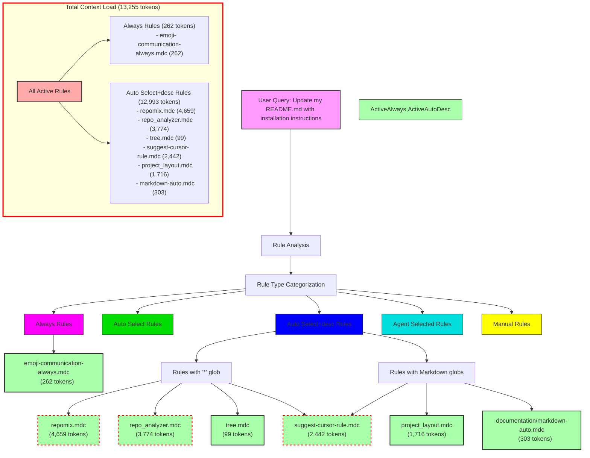

# Query Analysis: "Update my README.md with installation instructions"

## Activated Rules

| Rule                           | Type             | Token Count | Impact     | Activation Reason                      |
| ------------------------------ | ---------------- | ----------- | ---------- | -------------------------------------- |
| emoji-communication-always.mdc | Always           | 262         | Low        | Always applied                         |
| repomix.mdc                    | Auto Select+desc | 4,659       | High       | "*" glob matches Markdown files        |
| repo_analyzer.mdc              | Auto Select+desc | 3,774       | High       | "*" glob matches Markdown files        |
| tree.mdc                       | Auto Select+desc | 99          | Low        | "*" glob matches Markdown files        |
| suggest-cursor-rule.mdc        | Auto Select+desc | 2,442       | High       | "**/*" glob matches Markdown files     |
| project_layout.mdc             | Auto Select+desc | 1,716       | Medium     | "**/*.md" glob pattern                 |
| documentation/markdown-auto.mdc| Auto Select+desc | 303         | Low        | "**/*.md" glob pattern                 |
| **TOTAL**                      |                  | **13,255**  | **Very High** |                                     |

## Mermaid Diagram

## Token Impact Analysis

The current rule configuration adds 13,255 tokens to the LLM context for a Markdown file update query. This is a very high token count that significantly impacts:

1. Response quality - excessive context can dilute the LLM's focus on the actual task
2. Token usage costs - adds unnecessary tokens to every interaction involving Markdown files
3. Response speed - processing larger contexts takes more time

The Auto Select+desc rules account for 98% of the total token usage, with just three rules (repomix.mdc, repo_analyzer.mdc, and suggest-cursor-rule.mdc) contributing 10,875 tokens (82% of the total).

A notable observation is that markdown-auto.mdc, which is specifically designed for Markdown files, only contributes 303 tokens (2.3% of the total), while generic rules with wildcard globs contribute the vast majority of tokens.

## Recommendations

1. Convert high-impact rules to manual invocation:
   - repomix.mdc (4,659 tokens) → @repomix
   - repo_analyzer.mdc (3,774 tokens) → @repo-analyzer
   - suggest-cursor-rule.mdc (2,442 tokens) → @suggest-cursor-rule

2. Consider more specific glob patterns:
   - Multiple rules use wildcard globs ("*" or "**/*") which activate on almost any file
   - For Markdown files, tree.mdc could use a more specific glob if repository structure is needed

3. Keep low-impact rules as automatic:
   - emoji-communication-always.mdc (262 tokens) is reasonable for an Always rule
   - markdown-auto.mdc (303 tokens) is the most relevant rule for Markdown files and is low impact
   - tree.mdc (99 tokens) is low impact and can remain automatic

4. Consider restructuring project_layout.mdc:
   - At 1,716 tokens, it's a significant contributor to context bloat
   - Consider splitting into smaller, more focused rules or making it manual invocation

These changes could reduce the automatic context load by approximately 10,875 tokens (82%) for Markdown file operations, while keeping the most relevant rules (markdown-auto.mdc) active by default.
