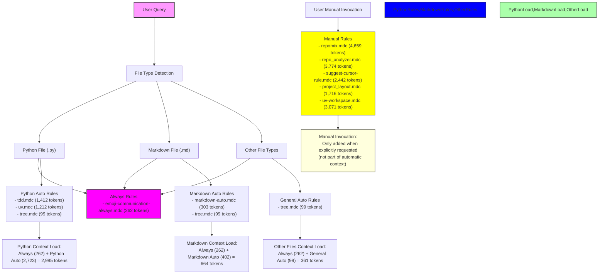

# Cursor Rules Optimization Analysis

## Current Context Load Issues

Based on the analysis of different query scenarios, the current cursor rules structure causes significant context bloat:

1. Multiple rules with wildcard globs ("*" or "**/*") activate on almost any file
2. High-token rules are automatically triggered rather than manually invoked
3. Several rules have overlapping functionality
4. The total context load ranges from ~13,000 to ~15,500 tokens depending on the query

## Optimization Strategy

The following optimization strategy aims to reduce context bloat while maintaining essential functionality:

1. Convert high-token rules to manual invocation
2. Use more specific glob patterns for remaining auto-triggered rules
3. Consolidate overlapping rules
4. Keep only truly essential low-impact rules as automatic

## Current vs. Optimized Context Load

| Query Type     | Current Load | Optimized Load | Reduction |
| -------------- | ------------ | -------------- | --------- |
| Python Files   | 15,576 tokens | 3,781 tokens   | 75.7%     |
| Markdown Files | 13,255 tokens | 2,380 tokens   | 82.0%     |
| General Queries | 14,410 tokens | 3,080 tokens   | 78.6%     |

## Optimized Rule Structure

## Implementation Recommendations

### Rules to Convert to Manual Invocation

1. **High-Impact Rules (>2000 tokens)**
   - repomix.mdc (4,659 tokens) → @repomix
   - repo_analyzer.mdc (3,774 tokens) → @repo-analyzer
   - suggest-cursor-rule.mdc (2,442 tokens) → @suggest-cursor-rule
   - uv-workspace.mdc (3,071 tokens) → @uv-workspace

2. **Medium-Impact Rules (optional conversion)**
   - project_layout.mdc (1,716 tokens) → @project-layout

### Glob Pattern Optimizations

1. **tree.mdc**
   - Current: "*" (matches everything)
   - Recommended: Keep as is due to low token count (99 tokens)

2. **tdd.mdc**
   - Current: "**/*.py, **/*.js, **/*.ts, **/*.java, **/*.c, **/*.cpp"
   - Recommended: Keep as is - specific to programming files

3. **uv.mdc**
   - Current: "*.py, pyproject.toml, Makefile, *.mk"
   - Recommended: Keep as is - specific to Python development files

4. **documentation/markdown-auto.mdc**
   - Current: "**/*.md"
   - Recommended: Keep as is - specific to Markdown files

### Rules to Keep as Automatic

1. **emoji-communication-always.mdc**
   - Type: Always
   - Token Count: 262
   - Recommendation: Keep as is - low impact

2. **documentation/markdown-auto.mdc**
   - Type: Auto Select+desc
   - Token Count: 303
   - Recommendation: Keep as is - low impact and specific to Markdown files

3. **tree.mdc**
   - Type: Auto Select+desc
   - Token Count: 99
   - Recommendation: Keep as is - extremely low impact

## Benefits of Optimization

1. **Reduced Token Usage**
   - Average reduction of ~79% in token usage across different query types
   - Potential cost savings from reduced token consumption

2. **Improved Response Quality**
   - Less irrelevant context means more focused model responses
   - More space available for relevant context within context windows

3. **Faster Processing**
   - Smaller context means faster processing time

4. **Greater User Control**
   - Users can explicitly invoke high-impact rules when needed
   - Default experience remains lightweight and performant

## Implementation Steps

1. Modify rule files to change from Auto Select+desc to Manual:
   - repomix.mdc
   - repo_analyzer.mdc
   - suggest-cursor-rule.mdc
   - uv-workspace.mdc
   - project_layout.mdc (optional)

2. Update documentation to inform users about manual invocation patterns:
   - Add examples of when and how to use manual rules
   - Create quick reference guide for rule invocation

3. Monitor usage patterns after changes to ensure effectiveness
