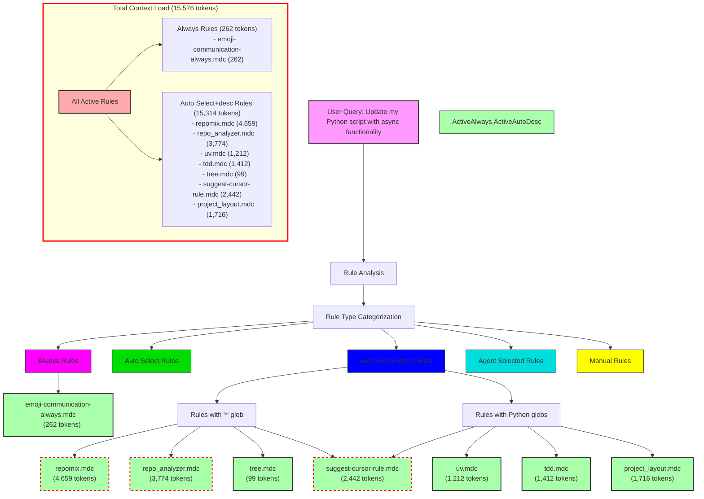

# Query Analysis: "Update my Python script with async functionality"

## Activated Rules

| Rule                           | Type             | Token Count | Impact     | Activation Reason                      |
| ------------------------------ | ---------------- | ----------- | ---------- | -------------------------------------- |
| emoji-communication-always.mdc | Always           | 262         | Low        | Always applied                         |
| repomix.mdc                    | Auto Select+desc | 4,659       | High       | "*" glob matches Python files          |
| repo_analyzer.mdc              | Auto Select+desc | 3,774       | High       | "*" glob matches Python files          |
| uv.mdc                         | Auto Select+desc | 1,212       | Medium     | "*.py" glob pattern                    |
| tdd.mdc                        | Auto Select+desc | 1,412       | Medium     | "**/*.py" glob pattern                 |
| tree.mdc                       | Auto Select+desc | 99          | Low        | "*" glob matches Python files          |
| suggest-cursor-rule.mdc        | Auto Select+desc | 2,442       | High       | "**/*" glob matches Python files       |
| project_layout.mdc             | Auto Select+desc | 1,716       | Medium     | "**/*.py" glob pattern                 |
| **TOTAL**                      |                  | **15,576**  | **Very High** |                                     |

## Mermaid Diagram

## Token Impact Analysis

The current rule configuration adds 15,576 tokens to the LLM context for a Python file modification query. This is an extremely high token count that significantly impacts:

1. Response quality - the large context may dilute the LLM's focus on the actual task
2. Token usage costs - adds unnecessary tokens to every interaction
3. Response speed - processing larger contexts takes more time

The Auto Select+desc rules account for 98.3% of the total token usage, with just three rules (repomix.mdc, repo_analyzer.mdc, and suggest-cursor-rule.mdc) contributing 10,875 tokens (69.8% of the total).

## Recommendations

1. Convert high-impact rules to manual invocation:
   - repomix.mdc (4,659 tokens) → @repomix
   - repo_analyzer.mdc (3,774 tokens) → @repo-analyzer
   - suggest-cursor-rule.mdc (2,442 tokens) → @suggest-cursor-rule

2. Consider more specific glob patterns:
   - Multiple rules use wildcard globs ("*" or "**/*") which activate on almost any file
   - For the Python-specific use case, tree.mdc could use a more specific glob

3. Consolidate similar functionality:
   - uv.mdc and project_layout.mdc have some overlapping Python project concepts

4. Keep low-impact rules as automatic:
   - emoji-communication-always.mdc (262 tokens) is reasonable for an Always rule
   - tree.mdc (99 tokens) is low impact and can remain automatic

These changes could reduce the automatic context load by approximately 10,875 tokens (69.8%) for Python file operations.
