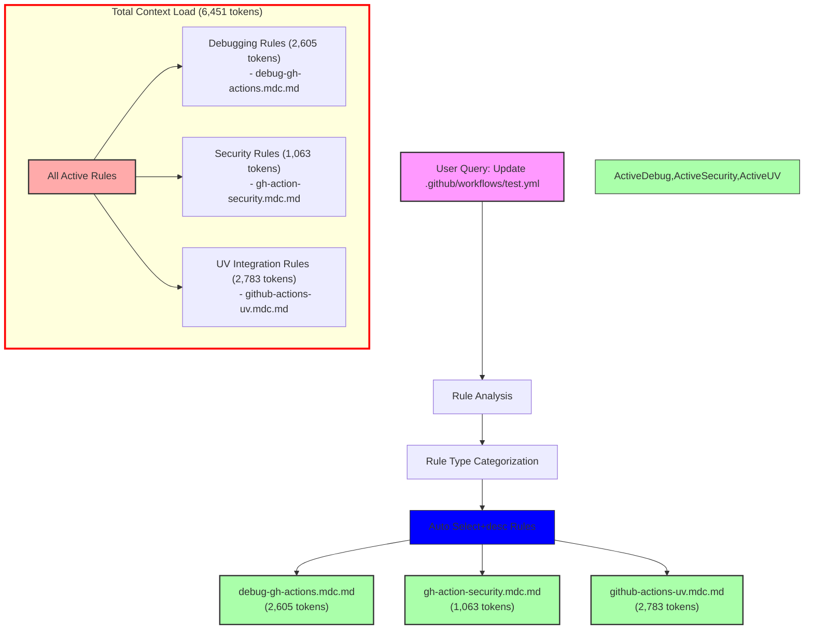

# Query Analysis: "Update my .github/workflows/test.yml file"

## Activated Rules

| Rule                           | Type             | Token Count | Impact     | Activation Reason |
| ----------------------------- | ---------------- | ----------- | ---------- | ---------------- |
| debug-gh-actions.mdc.md       | Auto Select+desc | 2,605       | High       | .github/workflows/*.yml match |
| gh-action-security.mdc.md     | Auto Select+desc | 1,063       | Medium     | .github/workflows/*.yml match |
| github-actions-uv.mdc.md      | Auto Select+desc | 2,783       | High       | .github/workflows/*.yml match |
| **TOTAL**                     |                  | **6,451**   | **Very High** | |

## Mermaid Diagram



## Token Impact Analysis

The current rule configuration adds 6,451 tokens to the LLM context for a GitHub Actions workflow file update query. While this is lower than the Python file example, it's still in the Very High impact category and could affect response quality.

The token usage breaks down into three categories:
1. UV Integration Rules: 2,783 tokens (43.1%)
2. Debugging Rules: 2,605 tokens (40.4%)
3. Security Rules: 1,063 tokens (16.5%)

## Recommendations

1. **Rule Consolidation:**
   - Combine `debug-gh-actions.mdc.md` and `github-actions-uv.mdc.md` into a single comprehensive GitHub Actions guide
   - Keep `gh-action-security.mdc.md` separate as it's focused and relatively small

2. **Content Optimization:**
   - Extract common patterns between debugging and UV integration rules to reduce duplication
   - Create a base GitHub Actions rule that includes essential patterns
   - Move specialized debugging and UV integration content to separate sections

3. **Proposed Structure:**
   ```
   github-actions-base.mdc.md (~1,500 tokens)
   ├── github-actions-security.mdc.md (~1,000 tokens)
   ├── github-actions-debug.mdc.md (~1,500 tokens)
   └── github-actions-uv.mdc.md (~1,500 tokens)
   ```

These changes could reduce the automatic context load by approximately 2,000 tokens (31%), bringing it down to around 4,500 tokens for GitHub Actions operations while maintaining all functionality through better organization.

4. **Alternative Approach:**
   - Convert `github-actions-uv.mdc.md` to manual invocation (@github-actions-uv)
   - Keep debugging and security rules as Auto Select+desc
   - This would reduce automatic context load to 3,668 tokens (43% reduction)

The choice between these approaches depends on how frequently UV-specific GitHub Actions features are needed in the workflow files.
