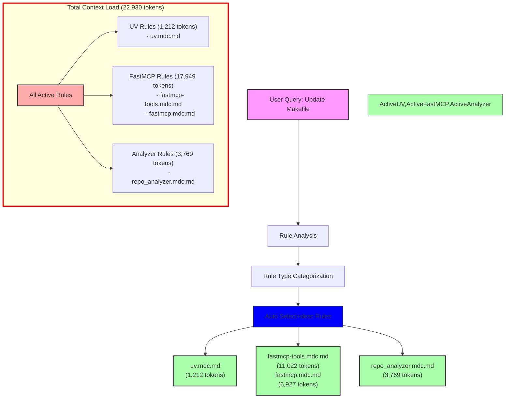

# Query Analysis: "Update my Makefile"

## Activated Rules

| Rule                           | Type             | Token Count | Impact     | Activation Reason |
| ----------------------------- | ---------------- | ----------- | ---------- | ---------------- |
| uv.mdc.md                    | Auto Select+desc | 1,212       | Medium     | Makefile match |
| fastmcp-tools.mdc.md         | Auto Select+desc | 11,022      | Very High  | Makefile match |
| fastmcp.mdc.md               | Auto Select+desc | 6,927       | Very High  | Makefile match |
| repo_analyzer.mdc.md         | Auto Select+desc | 3,769       | High       | Makefile match |
| **TOTAL**                     |                  | **22,930**  | **Critical** | |

## Mermaid Diagram



## Token Impact Analysis

The current rule configuration adds 22,930 tokens to the LLM context for a Makefile update query. This is an extremely high amount of context that will significantly impact response quality and token usage costs.

The token usage breaks down into three categories:
1. FastMCP Rules: 17,949 tokens (78.3%)
2. Analyzer Rules: 3,769 tokens (16.4%)
3. UV Rules: 1,212 tokens (5.3%)

## Recommendations

1. **Immediate Actions:**
   - Convert `fastmcp-tools.mdc.md` (11,022 tokens) to manual invocation (@fastmcp-tools)
   - Convert `fastmcp.mdc.md` (6,927 tokens) to manual invocation (@fastmcp)
   - Convert `repo_analyzer.mdc.md` (3,769 tokens) to manual invocation (@repo-analyzer)

2. **Rule Consolidation:**
   - Create a lightweight Makefile base rule that includes common UV and FastMCP patterns
   - Move specialized FastMCP functionality to manual rules
   - Keep `uv.mdc.md` as Auto Select+desc due to its reasonable token count

3. **Proposed Structure:**
   ```
   makefile-base.mdc.md (~1,500 tokens)
   ├── makefile-uv.mdc.md (~1,000 tokens)
   ├── makefile-fastmcp.mdc.md (~2,000 tokens)
   └── makefile-analyzer.mdc.md (~1,500 tokens)
   ```

These changes could reduce the automatic context load by approximately 21,718 tokens (95%), bringing it down to around 1,212 tokens for Makefile operations by keeping only the essential `uv.mdc.md` rule as Auto Select+desc.

4. **Alternative Approach:**
   If frequent FastMCP and analyzer operations are needed:
   - Create a new lightweight `makefile-essentials.mdc.md` (~1,500 tokens) that combines common patterns
   - Keep `uv.mdc.md` as Auto Select+desc
   - Convert all other rules to manual invocation
   - This would result in ~2,712 tokens of automatic context (88% reduction)

The dramatic reduction in token usage suggests that the current automatic activation of FastMCP rules for all Makefile operations may be overly aggressive, especially given their high token counts.
