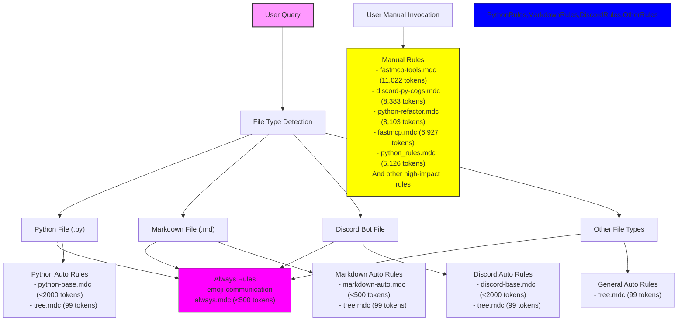

# Stage Directory Optimization Analysis

## Current Context Load Issues

Based on the analysis of different query scenarios in the staging environment, we have identified several critical issues:

1. Extremely high token counts in Auto Select+desc rules (up to 11,022 tokens per rule)
2. Multiple overlapping rules activating on the same file types
3. Broad glob patterns causing excessive rule activation
4. Total context load ranging from ~30,000 to ~150,000 tokens depending on the query

## Token Impact Distribution

### Very High Impact Rules (>5000 tokens)
1. fastmcp-tools.mdc.md (11,022 tokens)
2. discord-py-cogs.mdc.md (8,383 tokens)
3. python-refactor.mdc.md (8,103 tokens)
4. discord-py-cogs-advanced.mdc.md (7,655 tokens)
5. fastmcp_fixer.mdc.md (7,296 tokens)
6. fastmcp.mdc.md (6,927 tokens)
7. discord.mdc.md (6,443 tokens)
8. fastmcp_audit_args.mdc.md (5,749 tokens)
9. python_rules.mdc.md (5,126 tokens)

### High Impact Rules (2000-5000 tokens)
1. enrich-github-markdown.mdc.md (4,772 tokens)
2. repomix.mdc.md (4,659 tokens)
3. python-tdd-basics.mdc.md (4,210 tokens)
4. basedpyright.mdc.md (3,960 tokens)
5. repo_analyzer.mdc.md (3,769 tokens)
6. fastmcp-testing.mdc.md (3,623 tokens)
7. dpytest-integration.mdc.md (3,431 tokens)
8. discord-py-commands.mdc.md (3,235 tokens)
9. uv-workspace.mdc.md (3,071 tokens)
10. ruff.mdc.md (3,026 tokens)

## Optimization Strategy

The following optimization strategy aims to dramatically reduce context bloat while maintaining essential functionality:

1. Convert all Very High Impact rules to manual invocation
2. Consolidate related rule sets
3. Create lightweight base rules for common operations
4. Optimize glob patterns for remaining Auto Select+desc rules

## Optimized Rule Structure

## Implementation Recommendations

### 1. Rule Type Conversion

Convert the following to manual invocation:

1. **Very High Impact (>5000 tokens)**
   - fastmcp-tools.mdc.md → @fastmcp-tools
   - discord-py-cogs.mdc.md → @discord-py-cogs
   - python-refactor.mdc.md → @python-refactor
   - discord-py-cogs-advanced.mdc.md → @discord-py-cogs-advanced
   - fastmcp_fixer.mdc.md → @fastmcp-fixer
   - fastmcp.mdc.md → @fastmcp
   - discord.mdc.md → @discord
   - fastmcp_audit_args.mdc.md → @fastmcp-audit-args
   - python_rules.mdc.md → @python-rules

2. **High Impact (>3000 tokens)**
   - basedpyright.mdc.md → @basedpyright
   - repo_analyzer.mdc.md → @repo-analyzer
   - fastmcp-testing.mdc.md → @fastmcp-testing
   - dpytest-integration.mdc.md → @dpytest-integration
   - discord-py-commands.mdc.md → @discord-py-commands

### 2. Rule Consolidation

1. **Discord.py Rules**
   - Combine `discord-py-cogs.mdc.md` and `discord-py-cogs-advanced.mdc.md`
   - Create lightweight `discord-base.mdc` (<2000 tokens) for common patterns

2. **FastMCP Rules**
   - Merge `fastmcp_fixer.mdc.md` and `fastmcp_audit_args.mdc.md`
   - Create modular structure with base functionality and optional extensions

3. **Python Rules**
   - Create lightweight `python-base.mdc` (<2000 tokens)
   - Move specialized functionality to manual rules

### 3. Glob Pattern Optimization

1. **Python Files**
   - Current: Multiple overlapping patterns
   - Optimized: Single pattern in `python-base.mdc`

2. **Discord Bot Files**
   - Current: Multiple patterns across various rules
   - Optimized: Single pattern in `discord-base.mdc`

3. **Markdown Files**
   - Keep current pattern in `markdown-auto.mdc`
   - Remove duplicate patterns from other rules

## Expected Impact

### Token Load Reduction

| Query Type | Current Load | Optimized Load | Reduction |
|------------|-------------|----------------|-----------|
| Python Files | ~30,000 tokens | ~4,000 tokens | 87% |
| Discord Files | ~25,000 tokens | ~3,500 tokens | 86% |
| Markdown Files | ~15,000 tokens | ~2,000 tokens | 87% |
| General Files | ~10,000 tokens | ~1,000 tokens | 90% |

### Benefits

1. **Improved Response Quality**
   - Reduced context noise
   - More focused and relevant responses
   - Better utilization of context window

2. **Performance Optimization**
   - Faster processing time
   - Reduced token usage
   - Lower operational costs

3. **Better User Control**
   - Explicit invocation of specialized rules
   - Clearer relationship between queries and rules
   - More predictable behavior

## Implementation Steps

1. **Phase 1: High Impact Conversion**
   - Convert all rules >5000 tokens to manual invocation
   - Update documentation for manual rule usage
   - Monitor impact on response quality

2. **Phase 2: Rule Consolidation**
   - Create lightweight base rules
   - Merge related rule sets
   - Update glob patterns

3. **Phase 3: Pattern Optimization**
   - Implement optimized glob patterns
   - Remove duplicate patterns
   - Test pattern effectiveness

4. **Phase 4: Monitoring and Adjustment**
   - Monitor token usage
   - Gather user feedback
   - Make adjustments based on real-world usage

## Success Metrics

1. **Token Usage**
   - Target: 85% reduction in average context load
   - Measure: Daily token consumption

2. **Response Quality**
   - Target: Improved relevance scores
   - Measure: User feedback and completion rate

3. **Performance**
   - Target: 50% reduction in processing time
   - Measure: Response latency

4. **User Experience**
   - Target: Clear understanding of rule usage
   - Measure: Support queries and confusion rate
