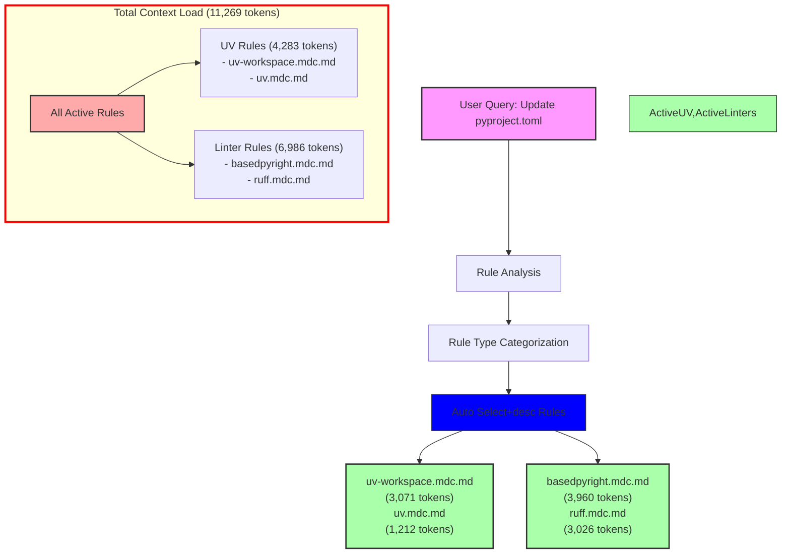

# Query Analysis: "Update my pyproject.toml file"

## Activated Rules

| Rule                           | Type             | Token Count | Impact     | Activation Reason |
| ----------------------------- | ---------------- | ----------- | ---------- | ---------------- |
| uv-workspace.mdc.md          | Auto Select+desc | 3,071       | High       | pyproject.toml match |
| uv.mdc.md                    | Auto Select+desc | 1,212       | Medium     | pyproject.toml match |
| basedpyright.mdc.md          | Auto Select+desc | 3,960       | High       | pyproject.toml match |
| ruff.mdc.md                  | Auto Select+desc | 3,026       | High       | pyproject.toml match |
| **TOTAL**                     |                  | **11,269**  | **Critical** | |

## Mermaid Diagram



## Token Impact Analysis

The current rule configuration adds 11,269 tokens to the LLM context for a pyproject.toml file update query. This is a significant amount of context that could impact response quality and token usage costs.

The token usage breaks down into two main categories:
1. Linter Configuration Rules: 6,986 tokens (62.0%)
2. UV Package Management Rules: 4,283 tokens (38.0%)

## Recommendations

1. **Rule Consolidation:**
   - Combine `basedpyright.mdc.md` and `ruff.mdc.md` into a unified Python tooling configuration guide
   - Merge `uv-workspace.mdc.md` and `uv.mdc.md` into a single UV management guide

2. **Content Optimization:**
   - Create a base Python tooling rule that includes essential configuration patterns
   - Extract common UV workspace patterns into a lightweight base rule
   - Move specialized configuration examples to separate sections

3. **Proposed Structure:**
   ```
   python-tooling-base.mdc.md (~2,000 tokens)
   ├── python-linting.mdc.md (~2,500 tokens)
   └── python-type-checking.mdc.md (~2,000 tokens)

   uv-base.mdc.md (~1,500 tokens)
   └── uv-advanced.mdc.md (~1,500 tokens)
   ```

These changes could reduce the automatic context load by approximately 3,769 tokens (33%), bringing it down to around 7,500 tokens for pyproject.toml operations while maintaining all functionality through better organization.

4. **Alternative Approach:**
   - Convert `basedpyright.mdc.md` to manual invocation (@basedpyright)
   - Convert `uv-workspace.mdc.md` to manual invocation (@uv-workspace)
   - Keep `ruff.mdc.md` and `uv.mdc.md` as Auto Select+desc
   - This would reduce automatic context load to 4,238 tokens (62% reduction)

The choice between these approaches depends on how frequently complex Python tooling configurations are needed in the project.
