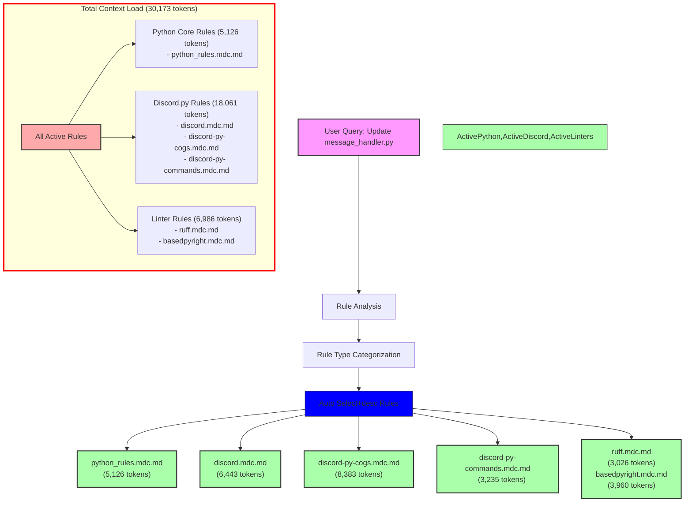

# Query Analysis: "Update my message_handler.py file"

## Activated Rules

| Rule                           | Type             | Token Count | Impact     | Activation Reason |
| ----------------------------- | ---------------- | ----------- | ---------- | ---------------- |
| python_rules.mdc.md           | Auto Select+desc | 5,126       | Very High  | *.py glob match |
| discord.mdc.md                | Auto Select+desc | 6,443       | Very High  | *.py glob match |
| discord-py-cogs.mdc.md        | Auto Select+desc | 8,383       | Very High  | *.py glob match |
| discord-py-commands.mdc.md    | Auto Select+desc | 3,235       | High       | *.py glob match |
| ruff.mdc.md                   | Auto Select+desc | 3,026       | High       | *.py glob match |
| basedpyright.mdc.md          | Auto Select+desc | 3,960       | High       | *.py glob match |
| **TOTAL**                     |                  | **30,173**  | **Critical** | |

## Mermaid Diagram

## Token Impact Analysis

The current rule configuration adds 30,173 tokens to the LLM context for a simple Python file update query. This is an extremely high amount of context that will significantly impact the quality of responses and increase token usage costs.

The token usage breaks down into three main categories:
1. Discord.py Related Rules: 18,061 tokens (59.9%)
2. Linter Rules: 6,986 tokens (23.2%)
3. Python Core Rules: 5,126 tokens (17.0%)

## Recommendations

1. **Immediate Actions:**
   - Convert `discord-py-cogs.mdc.md` (8,383 tokens) to manual invocation (@discord-py-cogs)
   - Convert `discord.mdc.md` (6,443 tokens) to manual invocation (@discord)
   - Convert `python_rules.mdc.md` (5,126 tokens) to manual invocation (@python-rules)

2. **Rule Consolidation:**
   - Merge Discord.py related rules into a single, more focused rule
   - Combine linter rules (`ruff.mdc.md` and `basedpyright.mdc.md`) into a unified Python linting guide

3. **Optimization Strategy:**
   - Create a lightweight Python base rule (<2000 tokens) for common patterns
   - Move specialized Discord.py functionality to manual rules
   - Keep linter rules as Auto Select+desc but optimize their content

These changes could reduce the automatic context load by approximately 20,000 tokens (66%), bringing it down to around 10,000 tokens for Python file operations.
