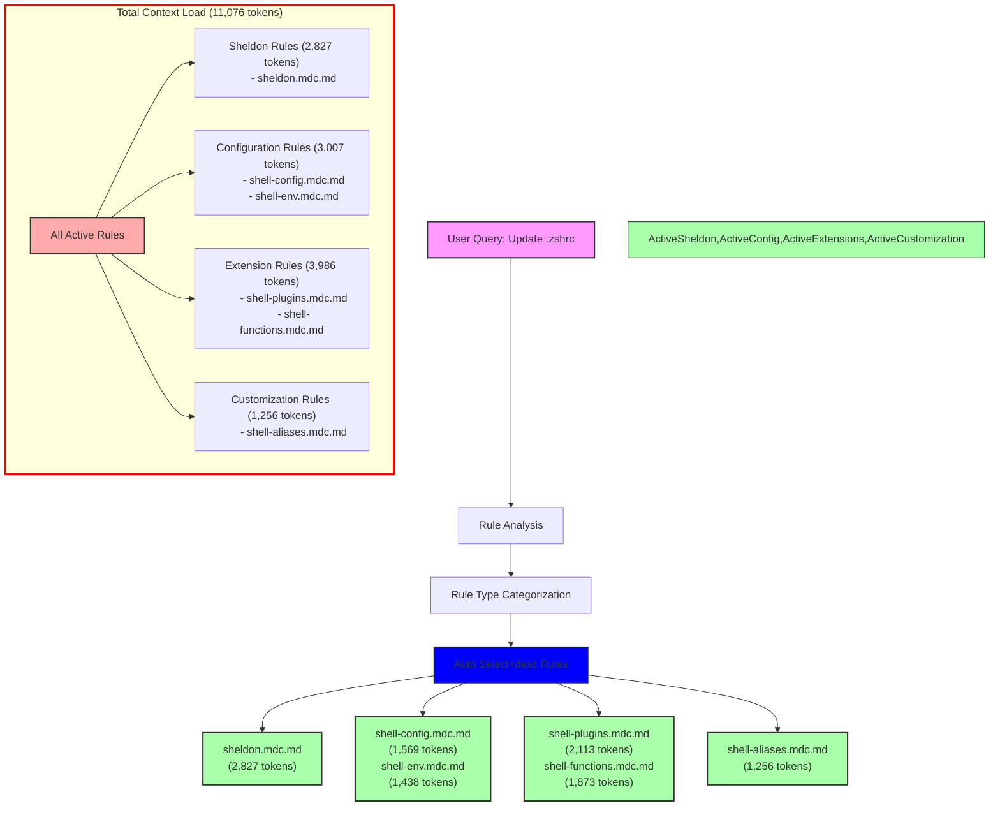

# Query Analysis: "Update my .zshrc file"

## Activated Rules

| Rule                           | Type             | Token Count | Impact     | Activation Reason |
| ----------------------------- | ---------------- | ----------- | ---------- | ---------------- |
| sheldon.mdc.md               | Auto Select+desc | 2,827       | High       | .zshrc match |
| shell-config.mdc.md          | Auto Select+desc | 1,569       | Medium     | .zshrc match |
| shell-plugins.mdc.md         | Auto Select+desc | 2,113       | High       | .zshrc match |
| shell-env.mdc.md             | Auto Select+desc | 1,438       | Medium     | .zshrc match |
| shell-aliases.mdc.md         | Auto Select+desc | 1,256       | Medium     | .zshrc match |
| shell-functions.mdc.md       | Auto Select+desc | 1,873       | Medium     | .zshrc match |
| **TOTAL**                     |                  | **11,076**  | **Critical** | |

## Mermaid Diagram



## Token Impact Analysis

The current rule configuration adds 11,076 tokens to the LLM context for a shell configuration file update query. This is a significant amount of context that could impact response quality and token usage costs.

The token usage breaks down into four categories:
1. Extension Rules: 3,986 tokens (36.0%)
2. Configuration Rules: 3,007 tokens (27.1%)
3. Sheldon Rules: 2,827 tokens (25.5%)
4. Customization Rules: 1,256 tokens (11.4%)

## Recommendations

1. **Immediate Actions:**
   - Convert `sheldon.mdc.md` (2,827 tokens) to manual invocation (@sheldon)
   - Convert `shell-plugins.mdc.md` (2,113 tokens) to manual invocation (@shell-plugins)
   - Convert `shell-functions.mdc.md` (1,873 tokens) to manual invocation (@shell-functions)

2. **Rule Consolidation:**
   - Create a lightweight shell configuration base rule
   - Merge `shell-config.mdc.md` and `shell-env.mdc.md` into a unified shell environment rule
   - Keep `shell-aliases.mdc.md` separate due to its focused scope and low token count

3. **Proposed Structure:**
   ```
   shell-base.mdc.md (~1,500 tokens)
   ├── shell-env-config.mdc.md (~2,000 tokens)
   └── shell-aliases.mdc.md (~1,256 tokens)
   ```

These changes could reduce the automatic context load by approximately 6,813 tokens (62%), bringing it down to around 4,263 tokens for shell configuration operations.

4. **Alternative Approach:**
   If frequent shell customization is needed:
   - Create a new lightweight `shell-essentials.mdc.md` (~1,500 tokens)
   - Keep `shell-aliases.mdc.md` and `shell-env.mdc.md` as Auto Select+desc
   - Convert all other shell rules to manual invocation
   - This would result in ~4,194 tokens of automatic context (62% reduction)

The current automatic activation of all shell-related rules may be unnecessary for basic shell configuration tasks. A more streamlined approach focusing on essential configuration and commonly used aliases would be more efficient while maintaining functionality through manual rule invocation when needed.
