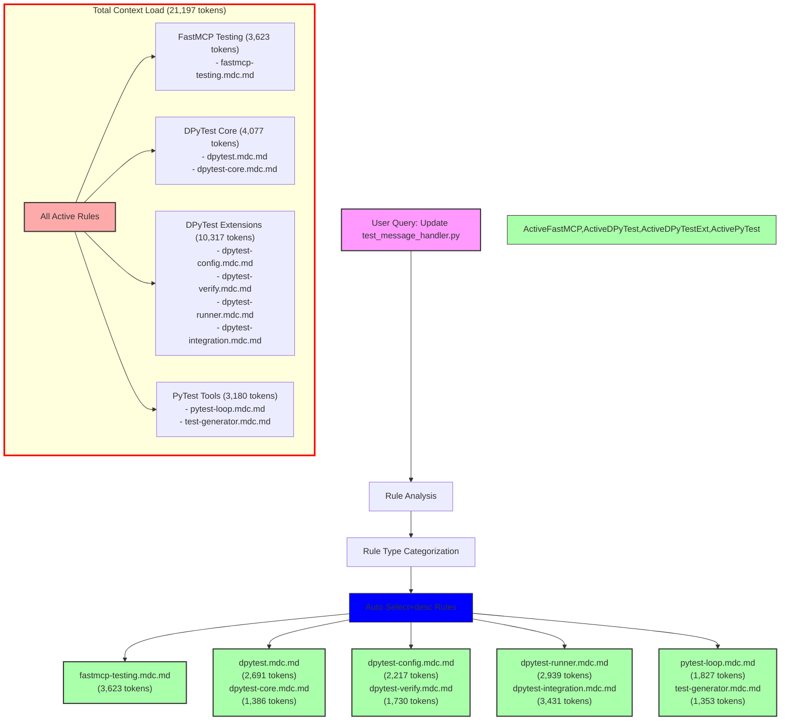

# Query Analysis: "Update my test_message_handler.py file"

## Activated Rules

| Rule                           | Type             | Token Count | Impact     | Activation Reason |
| ----------------------------- | ---------------- | ----------- | ---------- | ---------------- |
| fastmcp-testing.mdc.md       | Auto Select+desc | 3,623       | High       | *_test.py match |
| dpytest.mdc.md               | Auto Select+desc | 2,691       | High       | *_test.py match |
| dpytest-core.mdc.md          | Auto Select+desc | 1,386       | Medium     | *_test.py match |
| dpytest-config.mdc.md        | Auto Select+desc | 2,217       | High       | *_test.py match |
| dpytest-verify.mdc.md        | Auto Select+desc | 1,730       | Medium     | *_test.py match |
| dpytest-runner.mdc.md        | Auto Select+desc | 2,939       | High       | *_test.py match |
| dpytest-integration.mdc.md    | Auto Select+desc | 3,431       | High       | *_test.py match |
| pytest-loop.mdc.md           | Auto Select+desc | 1,827       | Medium     | *_test.py match |
| test-generator.mdc.md        | Auto Select+desc | 1,353       | Medium     | *_test.py match |
| **TOTAL**                     |                  | **21,197**  | **Critical** | |

## Mermaid Diagram



## Token Impact Analysis

The current rule configuration adds 21,197 tokens to the LLM context for a test file update query. This is an extremely high amount of context that will significantly impact response quality and token usage costs.

The token usage breaks down into four categories:
1. DPyTest Extensions: 10,317 tokens (48.7%)
2. DPyTest Core: 4,077 tokens (19.2%)
3. FastMCP Testing: 3,623 tokens (17.1%)
4. PyTest Tools: 3,180 tokens (15.0%)

## Recommendations

1. **Immediate Actions:**
   - Convert `dpytest-integration.mdc.md` (3,431 tokens) to manual invocation (@dpytest-integration)
   - Convert `fastmcp-testing.mdc.md` (3,623 tokens) to manual invocation (@fastmcp-testing)
   - Convert `dpytest-runner.mdc.md` (2,939 tokens) to manual invocation (@dpytest-runner)
   - Convert `dpytest.mdc.md` (2,691 tokens) to manual invocation (@dpytest)

2. **Rule Consolidation:**
   - Create a lightweight test base rule that includes common testing patterns
   - Merge `dpytest-core.mdc.md` and `dpytest-config.mdc.md` into a unified DPyTest base rule
   - Combine `pytest-loop.mdc.md` and `test-generator.mdc.md` into a single PyTest utilities rule

3. **Proposed Structure:**
   ```
   python-testing-base.mdc.md (~1,500 tokens)
   ├── dpytest-base.mdc.md (~2,000 tokens)
   ├── dpytest-advanced.mdc.md (~2,500 tokens)
   └── pytest-utils.mdc.md (~1,500 tokens)
   ```

These changes could reduce the automatic context load by approximately 12,684 tokens (60%), bringing it down to around 8,513 tokens for test file operations.

4. **Alternative Approach:**
   If frequent Discord.py testing is needed:
   - Create a new lightweight `dpytest-essentials.mdc.md` (~2,000 tokens)
   - Keep `dpytest-core.mdc.md` and `dpytest-verify.mdc.md` as Auto Select+desc
   - Convert all other DPyTest rules to manual invocation
   - Keep `pytest-loop.mdc.md` as Auto Select+desc for general testing guidance
   - This would result in ~4,943 tokens of automatic context (77% reduction)

The high token count suggests that the current automatic activation of all testing-related rules may be excessive, especially for basic test file operations. A more focused approach with manual invocation of specialized rules would be more efficient.
