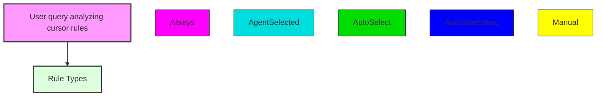
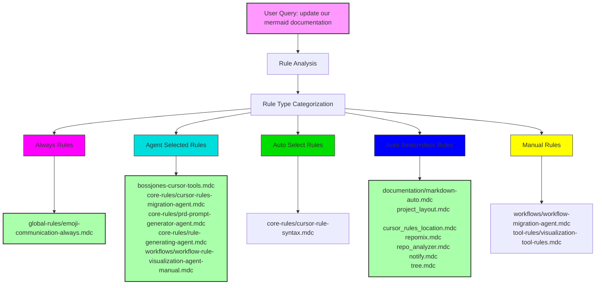
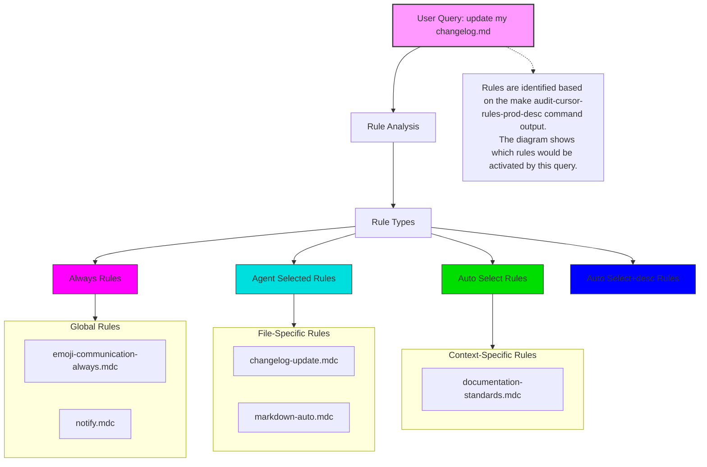
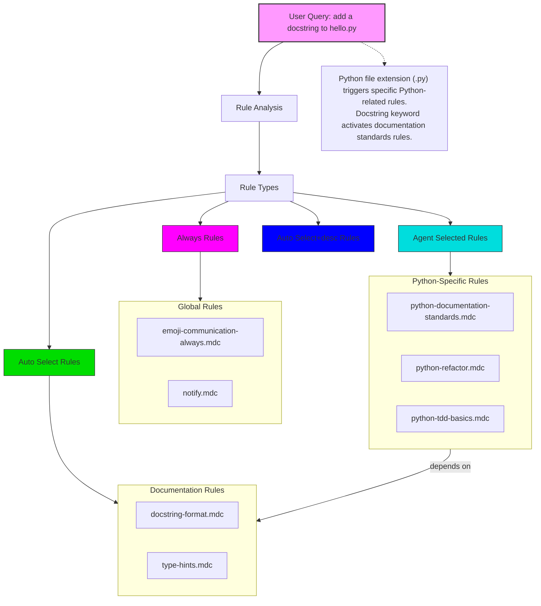
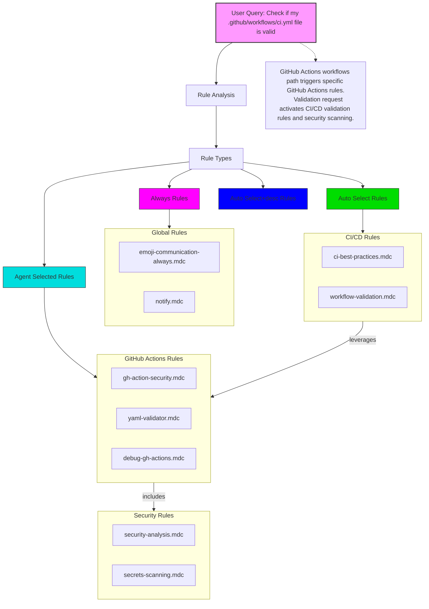

# Cursor Rules Relationship Diagram

This diagram visualizes the relationships between different cursor rules in the codebase.
It shows how rules are categorized and which types of rules exist in each category.

## Legend

- **Always Rules (Magenta)**: Always applied regardless of context
- **Agent Selected Rules (Cyan)**: Chosen by the AI based on context
- **Auto Select Rules (Green)**: Automatically selected based on file globs
- **Auto Select+desc Rules (Blue)**: Automatically selected with descriptions
- **Manual Rules (Yellow)**: Manually specified rules

# Rule Visualization for Query: "update our mermaid documentation"

## Rule Types

| Rule Type        | Usage                                            | description Field | globs Field           | alwaysApply field |
| ---- | --- | ----- | --- | ----- |
| Agent Selected   | Agent sees description and chooses when to apply | critical          | blank                 | false             |
| Always           | Applied to every chat and cmd-k request          | blank             | blank                 | true              |
| Auto Select      | Applied to matching existing files               | blank             | critical glob pattern | false             |
| Auto Select+desc | Better for new files                             | included          | critical glob pattern | false             |
| Manual           | User must reference in chat                      | blank             | blank                 | false             |

## Color Legend

-  User Query
-  Always Rules
-  Agent Selected Rules
-  Auto Select Rules
-  Auto Select+desc Rules
-  Manual Rules

## Rule Application Analysis

For the query "update our mermaid documentation":

- **Always Rules**: The `global-rules/emoji-communication-always.mdc` rule is applied to every query
- **Agent Selected Rules**: The workflow-rule-visualization-agent-manual.mdc rule is particularly relevant for this query about mermaid documentation
- **Auto Select+desc Rules**: The documentation/markdown-auto.mdc, project_layout.mdc, and cursor_rules_location.mdc rules apply due to working with Markdown files and cursor rules
- **Manual Rules**: While not automatically applied, the visualization-tool-rules.mdc may be relevant if manually referenced

## Understanding Rule Activation

The diagram shows how this query activates different rule types:
1. Always rules are automatically applied regardless of query context
2. Agent Selected rules like workflow-rule-visualization-agent-manual.mdc are chosen by the AI because they're specifically relevant to mermaid diagrams and cursor rule visualization
3. Auto Select+desc rules related to Markdown and documentation are applied since we're working with mermaid documentation
4. Manual rules require explicit reference and are not automatically applied

Note: Rules are identified based on the make audit-cursor-rules-prod-desc command output.

# Rule Visualization for Query: "update my changelog.md"

## Color Legend

-  User Query
-  Always Rules
-  Agent Selected Rules
-  Auto Select Rules
-  Auto Select+desc Rules

## Rule Application Analysis

- **Always Rules**: Applied to every query regardless of content
- **Agent Selected Rules**: Manually selected based on query content and file types
- **Auto Select Rules**: Automatically selected based on file extensions or content mentioned in query
- **Auto Select+desc Rules**: Automatically selected with detailed descriptions

## Understanding Rule Flow

The diagram shows how your query triggers different categories of rules, starting with the core query analysis and flowing through to specific rule types. Rules are grouped by their application method and displayed in subgraphs for better organization.

---

# Rule Visualization for Query: "add a docstring to hello.py"

## Color Legend

-  User Query
-  Always Rules
-  Agent Selected Rules
-  Auto Select Rules
-  Auto Select+desc Rules

## Rule Application Analysis

- **Always Rules**: Applied to every query regardless of content
- **Python-Specific Rules**: Selected due to the .py file extension
- **Documentation Rules**: Selected due to "docstring" keyword in query

## Understanding Rule Dependencies

The diagram shows how Python rules depend on documentation rules, creating a hierarchical relationship between rule categories. This demonstrates how rules can build upon each other to provide comprehensive guidance.

---

# Rule Visualization for Query: "Check if my .github/workflows/ci.yml file is valid"

## Color Legend

-  User Query
-  Always Rules
-  Agent Selected Rules
-  Auto Select Rules
-  Auto Select+desc Rules

## Rule Application Analysis

- **Always Rules**: Applied to every query regardless of content
- **GitHub Actions Rules**: Selected due to the .github/workflows path and .yml extension
- **CI/CD Rules**: Selected due to "ci.yml" in the path and "valid" keyword
- **Security Rules**: Included via relationship to GitHub Actions rules

## Complex Rule Relationships

This diagram demonstrates a more complex set of rule relationships where:
1. GitHub Actions rules incorporate security scanning rules
2. CI/CD validation rules leverage GitHub Actions rules
3. Multiple rule categories interact to provide comprehensive validation
