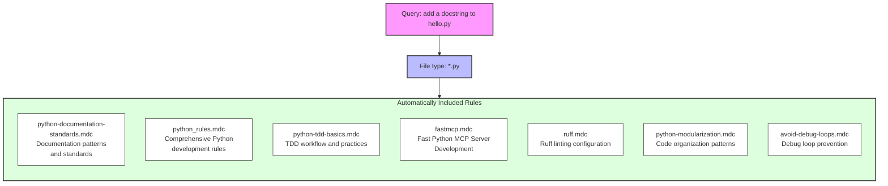

```mermaid
flowchart TD
    Query["Query: add a docstring to hello.py"]
    Query --> PyFile["File type: *.py"]

    subgraph AutoIncludedRules["Automatically Included Rules"]
        direction TB
        Documentation["python-documentation-standards.mdc\n Documentation patterns and standards"]
        PythonRules["python_rules.mdc\n Comprehensive Python development rules"]
        TDDBasics["python-tdd-basics.mdc\n TDD workflow and practices"]
        FastMCP["fastmcp.mdc\n Fast Python MCP Server Development"]
        Ruff["ruff.mdc\n Ruff linting configuration"]
        ModularRules["python-modularization.mdc\n Code organization patterns"]
        AvoidDebug["avoid-debug-loops.mdc\n Debug loop prevention"]
    end

    PyFile --> AutoIncludedRules

    style Query fill:#f9f,stroke:#333,stroke-width:2px
    style PyFile fill:#bbf,stroke:#333,stroke-width:2px
    style AutoIncludedRules fill:#dfd,stroke:#333,stroke-width:2px

    classDef ruleNode fill:#fff,stroke:#333,stroke-width:1px
    class Documentation,PythonRules,TDDBasics,FastMCP,Ruff,ModularRules,AvoidDebug ruleNode
```
