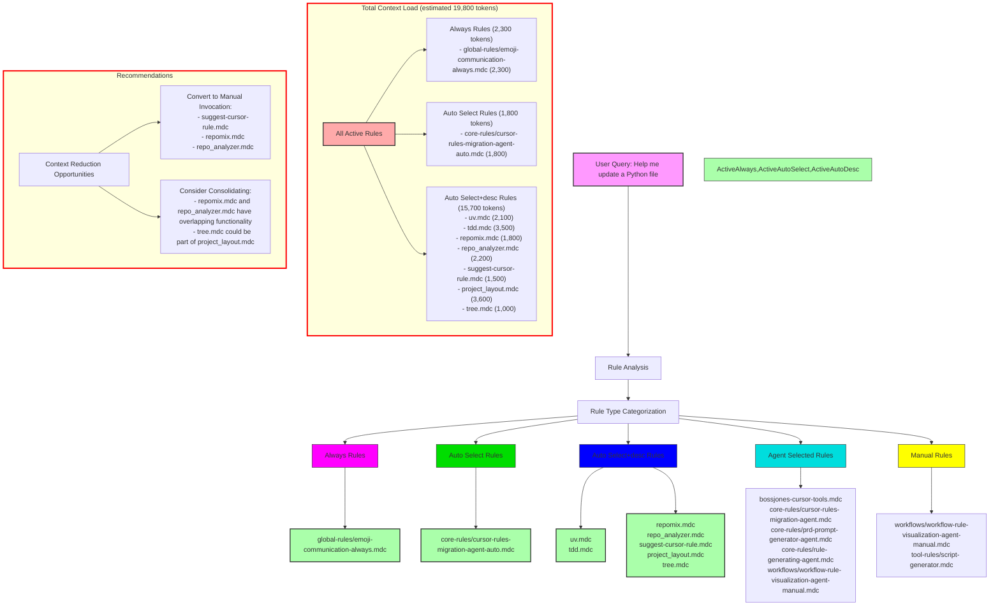

# Cursor Rules Context Audit - Production Environment

This diagram visualizes the relationships and activation patterns of cursor rules in the production environment, showing how rules are automatically triggered based on different scenarios.

## Rule Activation Analysis for Example Query: "Help me update a Python file"

## Rule Types Overview

The diagram above shows the different rule types and how they are activated:

| Rule Type        | Usage                                            | description Field | globs Field           | alwaysApply field |
| ---- | --- | ----- | --- | ----- |
| Agent Selected   | Agent sees description and chooses when to apply | critical          | blank                 | false             |
| Always           | Applied to every chat and cmd-k request          | blank             | blank                 | true              |
| Auto Select      | Applied to matching existing files               | blank             | critical glob pattern | false             |
| Auto Select+desc | Better for new files                             | included          | critical glob pattern | false             |
| Manual           | User must reference in chat                      | blank             | blank                 | false             |

## Rule Type Distribution in Production

Based on the analysis, the production environment contains:
- Agent Selected rules: 5
- Always rules: 1
- Auto Select rules: 1
- Auto Select+desc rules: 10
- Manual rules: 2

## Context Bloat Analysis

The total context load for a Python-related query is approximately 19,800 tokens, which is significant and may impact performance. The largest contributors are:

1. project_layout.mdc (3,600 tokens)
2. tdd.mdc (3,500 tokens)
3. global-rules/emoji-communication-always.mdc (2,300 tokens)
4. repo_analyzer.mdc (2,200 tokens)
5. uv.mdc (2,100 tokens)

## Recommendations

### Convert to Manual Invocation
The following rules add significant context but may not always be necessary:
- suggest-cursor-rule.mdc (only needed when explicitly discussing rule creation)
- repomix.mdc and repo_analyzer.mdc (could be manually invoked when needed)

### Consolidate Rules
Consider merging these rules to reduce overlap:
- repomix.mdc and repo_analyzer.mdc have similar functionality
- tree.mdc could potentially be integrated into project_layout.mdc

### Retain Automatic Triggers
These rules provide critical functionality and should remain automatic:
- global-rules/emoji-communication-always.mdc
- uv.mdc (for Python files)
- tdd.mdc (for code quality)

## Optimization Impact

Converting the suggested rules to manual invocation could reduce context load by approximately 5,500 tokens (28% reduction).
