# Cursor Rules Visualization - Production Environment

## Current Rule Structure and Relationships

```mermaid
%%{init: {'theme': 'base', 'themeVariables': {'fontSize': '16px', 'fontFamily': 'monospace'}}}%%
flowchart TD
    classDef always fill:#f0f,stroke:#333,stroke-width:2px
    classDef autoSelect fill:#0d0,stroke:#333,stroke-width:2px
    classDef autoSelectDesc fill:#00f,stroke:#333,stroke-width:2px
    classDef agentSelected fill:#0dd,stroke:#333,stroke-width:2px
    classDef manual fill:#ff0,stroke:#333,stroke-width:2px
    classDef high fill:#fdd,stroke:#f00,stroke-width:2px
    classDef medium fill:#ffd,stroke:#f80,stroke-width:2px
    classDef low fill:#dfd,stroke:#080,stroke-width:2px

    Root["Cursor Rules System"]

    %% Rule Type Categories
    Root --> Always["Always Rules"]
    Root --> AutoSelect["Auto Select Rules"]
    Root --> AutoSelectDesc["Auto Select+desc Rules"]
    Root --> AgentSelected["Agent Selected Rules"]
    Root --> Manual["Manual Rules"]

    %% Always Rules
    Always --> EmojiComm["emoji-communication-always.mdc
    (262 tokens)"]
    class EmojiComm always,low

    %% Auto Select Rules
    AutoSelect --> CodeDeletions["analyze-code-deletions-auto.mdc
    (545 tokens)"]
    class CodeDeletions autoSelect,medium

    %% Auto Select+desc Rules
    AutoSelectDesc --> Repomix["repomix.mdc
    (4,659 tokens)"]
    AutoSelectDesc --> RepoAnalyzer["repo_analyzer.mdc
    (3,774 tokens)"]
    AutoSelectDesc --> UV["uv.mdc
    (1,212 tokens)"]
    AutoSelectDesc --> TDD["tdd.mdc
    (1,412 tokens)"]
    AutoSelectDesc --> UVWorkspace["uv-workspace.mdc
    (3,071 tokens)"]
    AutoSelectDesc --> SuggestRule["suggest-cursor-rule.mdc
    (2,442 tokens)"]
    AutoSelectDesc --> ProjectLayout["project_layout.mdc
    (1,716 tokens)"]
    AutoSelectDesc --> Tree["tree.mdc
    (99 tokens)"]
    AutoSelectDesc --> CursorRulesLoc["cursor_rules_location.mdc
    (856 tokens)"]
    AutoSelectDesc --> MarkdownAuto["markdown-auto.mdc
    (303 tokens)"]

    class Repomix autoSelectDesc,high
    class RepoAnalyzer autoSelectDesc,high
    class UV autoSelectDesc,medium
    class TDD autoSelectDesc,medium
    class UVWorkspace autoSelectDesc,high
    class SuggestRule autoSelectDesc,high
    class ProjectLayout autoSelectDesc,medium
    class Tree autoSelectDesc,low
    class CursorRulesLoc autoSelectDesc,medium
    class MarkdownAuto autoSelectDesc,low

    %% Agent Selected Rules
    AgentSelected --> BossJonesTools["bossjones-cursor-tools.mdc
    (314 tokens)"]
    AgentSelected --> MigrationAgent["cursor-rules-migration-agent.mdc
    (625 tokens)"]
    AgentSelected --> PRDGenerator["prd-prompt-generator-agent.mdc
    (548 tokens)"]
    AgentSelected --> RuleGenerator["rule-generating-agent.mdc
    (999 tokens)"]
    AgentSelected --> VisAgent["workflow-rule-visualization-agent-manual.mdc
    (2,157 tokens)"]

    class BossJonesTools agentSelected,low
    class MigrationAgent agentSelected,medium
    class PRDGenerator agentSelected,medium
    class RuleGenerator agentSelected,medium
    class VisAgent agentSelected,high

    %% Manual Rules
    Manual --> GitPush["gitpush.mdc
    (243 tokens)"]
    Manual --> AgileWorkflow["workflow-agile-manual.mdc
    (783 tokens)"]

    class GitPush manual,low
    class AgileWorkflow manual,medium

    %% Context Load Summary
    subgraph ContextLoad["Total Context Load Analysis"]
        TotalTokens["Total Tokens: 25,020"]
        HighImpact["High Impact Rules (>2000 tokens): 5"]
        MediumImpact["Medium Impact Rules (500-2000 tokens): 8"]
        LowImpact["Low Impact Rules (<500 tokens): 6"]
    end

    style Root fill:#fff,stroke:#333,stroke-width:3px
    style Always fill:#f0f,stroke:#333,stroke-width:2px
    style AutoSelect fill:#0d0,stroke:#333,stroke-width:2px
    style AutoSelectDesc fill:#00f,stroke:#333,stroke-width:2px
    style AgentSelected fill:#0dd,stroke:#333,stroke-width:2px
    style Manual fill:#ff0,stroke:#333,stroke-width:2px
    style ContextLoad fill:#f8f8f8,stroke:#333,stroke-width:2px
```

## Rule Types Legend

| Rule Type | Usage | Description Field | Globs Field | alwaysApply field |
|-----------|-------|------------------|-------------|-------------------|
| Agent Selected | Agent sees description and chooses when to apply | critical | blank | false |
| Always | Applied to every chat and cmd-k request | blank | blank | true |
| Auto Select | Applied to matching existing files | blank | critical glob pattern | false |
| Auto Select+desc | Better for new files | included | critical glob pattern | false |
| Manual | User must reference in chat | blank | blank | false |

## Token Impact Categories

| Category | Token Range | Count | Color |
|----------|------------|-------|--------|
| High Impact | >2000 tokens | 5 | 🔴 Red |
| Medium Impact | 500-2000 tokens | 8 | 🟠 Orange |
| Low Impact | <500 tokens | 6 | 🟢 Green |

## Analysis and Recommendations

1. **High Impact Rules** (Consider optimization):
   - repomix.mdc (4,659 tokens)
   - repo_analyzer.mdc (3,774 tokens)
   - uv-workspace.mdc (3,071 tokens)
   - suggest-cursor-rule.mdc (2,442 tokens)
   - workflow-rule-visualization-agent-manual.mdc (2,157 tokens)

2. **Auto Select+desc Dominance**:
   - 10 rules are Auto Select+desc type
   - Consider if some could be converted to manual invocation to reduce context load

3. **Optimization Opportunities**:
   - Consider consolidating related rules (e.g., UV-related rules)
   - Review high-token rules for potential content reduction
   - Consider converting some Auto Select+desc rules to Manual for less frequent use cases

4. **Well-Balanced Areas**:
   - Good mix of Agent Selected rules (5)
   - Appropriate use of Manual rules for specific workflows
   - Single Always rule with low token count (262 tokens)

5. **Total System Impact**:
   - Total token count: 25,020
   - Average tokens per rule: 1,317
   - Median tokens per rule: 856
