# Cursor Rules Dependency Graph

This document visualizes the relationships and dependencies between cursor rules in the project.

## Rule Relationships

```mermaid
graph TD
    %% Core Rules
    core_rules[Core Rules]
    core_rules --> rule_gen[Rule Generating Agent]
    core_rules --> prd_gen[PRD Prompt Generator]
    core_rules --> rules_mig[Rules Migration Agent]

    %% Development Workflow
    greenfield[Greenfield Development]
    greenfield --> greenfield_doc[Documentation Standards]
    greenfield --> greenfield_exec[Execution Best Practices]
    greenfield --> greenfield_idx[Greenfield Index]
    greenfield --> tdd[Test-Driven Development]

    %% Testing Rules
    testing[Testing Framework]
    testing --> pytest_loop[Pytest Loop]
    testing --> pytest_suggest[Pytest Suggest 3 Fixes]
    testing --> test_gen[Test Generator]
    testing --> fastmcp_testing[FastMCP Testing]

    %% Code Analysis & Modification
    code_analysis[Code Analysis]
    code_analysis --> code_context[Code Context Gatherer]
    code_analysis --> repo_analyzer[Repository Analyzer]
    code_analysis --> repomix[Repomix Tool]
    code_analysis --> explain_code_mod[Explain Code Modification]

    %% Development Tools
    dev_tools[Development Tools]
    dev_tools --> iterative_dev[Iterative Development]
    dev_tools --> iterative_debug[Iterative Debug Fix]
    dev_tools --> incremental_task[Incremental Task Planner]
    dev_tools --> avoid_debug_loops[Avoid Debug Loops]

    %% Documentation
    docs[Documentation]
    docs --> changelog[Changelog Management]
    docs --> cheatsheet[Cheatsheet Creation]
    docs --> markdown_auto[Markdown Auto-formatting]
    docs --> update_md_lists[Update Markdown Lists]

    %% MCP Related
    mcp[MCP Framework]
    mcp --> mcp_spec[MCP Specification]
    mcp --> mcpclient[MCP Client]
    mcp --> fastmcp[FastMCP]
    mcp --> fastmcp_tools[FastMCP Tools]
    mcp --> fastmcp_audit[FastMCP Audit Args]
    mcp --> fastmcp_fixer[FastMCP Fixer]

    %% Package Management
    pkg_mgmt[Package Management]
    pkg_mgmt --> uv[UV Package Manager]
    pkg_mgmt --> uv_workspace[UV Workspace]

    %% Project Organization
    proj_org[Project Organization]
    proj_org --> project_layout[Project Layout]
    proj_org --> python_rules[Python Rules]
    proj_org --> python_refactor[Python Refactor]

    %% Tool Integration
    tools[Tool Integration]
    tools --> chezmoi[Chezmoi]
    tools --> sheldon[Sheldon]
    tools --> gh_action_security[GitHub Action Security]
    tools --> ruff[Ruff]

    %% Thinking Patterns
    thinking[Thinking Patterns]
    thinking --> anthropic_cot[Anthropic Chain of Thought]
    thinking --> tree_of_thought[Tree of Thought]

    %% Dependencies
    greenfield --> tdd
    test_gen --> pytest_loop
    iterative_dev --> tdd
    python_refactor --> tdd
    fastmcp_testing --> pytest_loop
    code_context --> repo_analyzer
    repomix --> code_context
    iterative_debug --> avoid_debug_loops
    markdown_auto --> update_md_lists
    mcpclient --> mcp_spec
    fastmcp --> mcp_spec
    fastmcp_tools --> fastmcp
    fastmcp_audit --> fastmcp
    fastmcp_fixer --> fastmcp
    uv_workspace --> uv
    python_rules --> tdd
    gh_action_security --> project_layout
```

## Key Relationships

1. **Core Rules**: Form the foundation for rule generation and management
2. **Development Workflow**: Centers around Greenfield development and TDD practices
3. **Testing Framework**: Interconnected testing tools and practices
4. **Code Analysis**: Tools for understanding and modifying code
5. **Development Tools**: Iterative development and debugging utilities
6. **Documentation**: Standards and tools for maintaining documentation
7. **MCP Framework**: Model Context Protocol implementation and tools
8. **Package Management**: UV package manager and workspace organization
9. **Project Organization**: Overall project structure and standards
10. **Tool Integration**: External tool configuration and security
11. **Thinking Patterns**: Cognitive frameworks for problem-solving

## Notes

- All rules ultimately contribute to maintaining code quality and development efficiency
- Testing rules have strong dependencies on TDD practices
- Documentation rules ensure consistent standards across the project
- MCP-related rules form a cohesive framework for model interaction
- Package management rules handle dependency organization
- Security rules integrate with various aspects of the project
